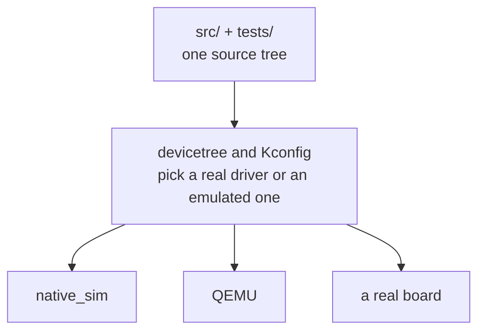
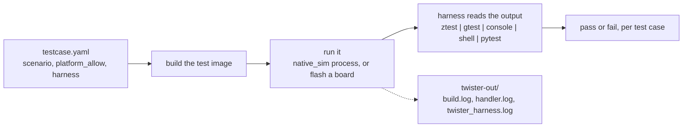

# Practical Embedded Automated Testing for Zephyr

[](https://github.com/royyandzakiy/zephyr-testing-workshop/actions/workflows/test-native-sim.yml)
[](https://github.com/royyandzakiy/zephyr-testing-workshop/actions/workflows/sanitizers.yml)


[](LICENSE)
[](https://vscode.dev/redirect?url=vscode%3A%2F%2Fms-vscode-remote.remote-containers%2FcloneInVolume%3Furl%3Dhttps%3A%2F%2Fgithub.com%2Froyyandzakiy%2Fzephyr-testing-workshop)

This repository is made to help understand automated testing with Zephyr. It works through the tools the
Zephyr ecosystem already provides for it: `native_sim` for running firmware on your own
machine, `ztest` for tests that run on the device, the emulator framework for faking a
pin or a chip, the shell subsystem as a way in from outside, Twister for building and
running suites and deciding pass or fail, and the sanitizers. Alongside those sit a few
things from outside Zephyr that fit the same job: FFF, GoogleTest, pytest, and GitHub
Actions.

Inside [`apps/`](apps/) is a set of small Zephyr applications, each a working example of
one way to test firmware:

- test frameworks, `ztest` and GoogleTest, both compiled into a Zephyr image
- emulated drivers, `gpio_emul` and `i2c_emul`, and an emulated I2C chip written here
- fakes with FFF, replacing the functions a module calls rather than the hardware
- the Zephyr shell as a test backdoor, driven from `pytest` for end to end runs
- Twister, and the different harnesses it can use to read a result
- CI with GitHub Actions: building, running under sanitizers, running off target, and
  flashing and running on target through a self-hosted runner

Every app builds and runs on `native_sim`, which compiles Zephyr as an ordinary program
for the machine you are sitting at. Several also carry overlays for common targets:
nRF5340DK, ESP32-S3, Nucleo G474RE and QEMU. Each app has its own tests, its own
`README.md` and its own `EXERCISE.md`.

Zephyr **v4.4.2**, SDK **1.0.1**

## Repository structure

```
.
├── apps/                  the examples, one folder per application
│   └── NN-name/
│       ├── src/               application source
│       ├── boards/            per-board overlays and Kconfig fragments
│       ├── tests/             suites for this app, each its own Zephyr application
│       ├── CMakeLists.txt, prj.conf
│       └── README.md, EXERCISE.md
├── docs/                  everything around the examples
│   ├── README.md              the index, and three routes through the rest
│   ├── setup/                 getting an environment working
│   ├── concepts/              what each kind of test answers, and what it cannot
│   ├── guides/                task walkthroughs, for example putting a board in CI
│   ├── reference/             commands, flags, fixtures
│   ├── troubleshooting.md     failures keyed by what you are looking at
│   ├── glossary.md            the vocabulary the docs assume
│   └── notes/                 working material, not written for a reader
├── .github/workflows/     GitHub Actions pipelines
├── .devcontainer/         the container definition. The whole toolchain lives in here.
├── .claude/skills/        Claude Code skills for building, testing and writing docs here
├── .clangd                so the editor resolves Zephyr headers instead of underlining them
└── .vscode/               editor settings
```

`.devcontainer`, `.clangd` and `.vscode` exist to make the thing work on your machine.
Nothing in them is part of the teaching material.

Documentation sits at three depths, and they do different jobs:

| | |
|---|---|
| each app's `README.md` | what that app is, how to run it, and what output to expect |
| each app's `EXERCISE.md` | things to change, break and look up, once the app itself makes sense |
| [`docs/`](docs/) | everything that is not about one app: setup, commands, concepts, troubleshooting |

[`docs/README.md`](docs/README.md) is the way in to that last one.

### CI

Four workflows under [`.github/workflows/`](.github/workflows/). Two run on every push,
on GitHub's own runners, and need no hardware. Two are manual and want a runner on your
own machine, one of them with a board attached.

| | Answers | When |
|---|---|---|
| `test-native-sim.yml` | do all the test suites still pass | push, pull request |
| `sanitizers.yml` | does one app run clean under ASan and UBSan | push, pull request |
| `build-check.yml` | does the toolchain work at all | manual |
| `test-hardware.yml` | does it build, flash and pass on a real board | manual |

[`docs/guides/ci.md`](docs/guides/ci.md) covers what each one does and the two things to
change for your own board.

## What is here



Projects inside this repo are made such that the same source will build for all the
different board targets. That is two separate decisions: which target you build for,
and whether a given peripheral is the real driver or an emulated one.

They are independent of each other. `gpio_emul`, `i2c_emul` and the rest are ordinary
drivers gated on a devicetree node, not a `native_sim` feature, so an emulated button
works just as well on an nRF5340DK. The suite in `apps/04-shell-pytest` runs both ways,
and [`.github/workflows/test-hardware.yml`](.github/workflows/test-hardware.yml)
runs it on the board.

What differs between targets is cost and reach. `native_sim` builds in seconds, needs no
hardware and runs in CI on any runner. A real board is the only place real timing, a
real peripheral or power behaviour shows up, and it costs a flash cycle, a board on
somebody's desk, and a self-hosted runner to put it in CI.

For the tests themselves, `ztest` is Zephyr's own framework and does most of the work
here. FFF and GoogleTest show up too, as examples of what else fits. `pytest` covers the
cases where the test needs to run outside the device and talk to it. There are other
options; these are the ones with a working example in this repo.

## Preparation

Everything builds inside a devcontainer, so Docker is the only thing you need
installed. The first container start downloads Zephyr and the SDK, so it is worth doing
before you need it.

1. **Use this template** to duplicate this repo to your own GitHub account, so you can push and watch your
   own Github Actions run.
2. **Install Docker.** Docker Desktop on Windows or macOS, Docker Engine on Linux.
   Confirm `docker run hello-world` works. Nothing else is needed on your machine.
3. **Clone your repository** and open it in VS Code. Accept the *"Reopen in Container"*
   prompt.

   There are two one-time waits. The first builds the container image, which is built
   from Ubuntu rather than pulled, so you see package installs scroll past instead of a
   download bar. The second downloads Zephyr and the Zephyr SDK into a shared Docker
   volume, and prints a `FIRST RUN ON THIS MACHINE` banner. That one happens once per
   machine, not once per project. Later starts take seconds and need no network.

4. **Check the toolchain** inside the container:

   ```bash
   cd apps/00-hello && west build -b native_sim/native -p && ./build/zephyr/zephyr.exe
   ```

5. **Run the test suite once.** This is the step most likely to fail, so do not skip
   it:

   ```bash
   west twister -T apps/ -p native_sim
   ```

Hardware is optional. If you have a board, build and flash to it and register a local
`actions-runner`. Nothing here requires one.

Setup notes: [`docs/setup/first-run.md`](docs/setup/first-run.md) and
[`docs/setup/build-flash-monitor.md`](docs/setup/build-flash-monitor.md).

## The apps

| App | What it is |
|---|---|
| [`00-hello`](apps/00-hello) | `printk` only. No devicetree, nothing to bind. A toolchain check. |
| [`01-blinky`](apps/01-blinky) | A button toggles an LED, through devicetree aliases. No tests. |
| [`02-ztest`](apps/02-ztest) | The decision logic moved into its own file, with a `ztest` suite over it. |
| [`03-emul-gpio`](apps/03-emul-gpio) | `gpio_emul` driving a fake button, with a test-only overlay that reroutes the aliases. |
| [`04-shell-pytest`](apps/04-shell-pytest) | A shell command as a test backdoor, with `pytest` asserting from outside the device. |
| [`05-pytest-advanced`](apps/05-pytest-advanced) | pytest fixtures, parametrization and markers. Also the same assertions with no Twister. |
| [`06-sensor`](apps/06-sensor) | I2C, the real Bosch BME280 driver, and an emulated chip written here because Zephyr ships none. |
| [`07-unit-conventions`](apps/07-unit-conventions) | ztest conventions: naming, AAA, fixtures, suite hooks, table-driven cases. |
| [`08-fff-mocks`](apps/08-fff-mocks) | FFF. Replacing the functions your module calls, rather than the chip underneath. |
| [`09-gtest-gmock`](apps/09-gtest-gmock) | GoogleTest and GoogleMock compiled into a Zephyr image. |

Each folder is a complete application and can be opened on its own.

Inside one:

```
apps/03-emul-gpio/
├── CMakeLists.txt
├── prj.conf                 application config
├── boards/                  per-board overlays and configs
├── src/                     application source
├── tests/                   suites for THIS app
│   ├── unit/                ztest, native_sim only
│   └── emul/                ztest + gpio_emul, with its own app.overlay
├── README.md                what this app is, and how to run it
└── EXERCISE.md              more to explore, graded ★ to ★★★
```

Tests live beside the app they test. Twister recurses, so `-T apps/` finds every suite
without a registry to maintain. Each `tests/*/` folder is itself a small Zephyr
application with its own `prj.conf` and `app.overlay`, and that overlay is where the
emulation gets swapped in.

## How Twister decides



## Commands

Run these inside the devcontainer.

**Build and run on your machine**

```bash
cd apps/01-blinky && west build -b native_sim/native -p && ./build/zephyr/zephyr.exe
```

**Build for a board and flash**

```bash
west build -b nrf5340dk/nrf5340/cpuapp -p && west flash
```

**Run one app's tests**

```bash
west twister -T apps/03-emul-gpio -p native_sim
```

**Run everything**, which is what CI does

```bash
west twister -T apps/ -p native_sim
```

**Run against a board**

```bash
west twister -T apps/04-shell-pytest --device-testing --hardware-map apps/04-shell-pytest/hardware-map.yaml
```

Edit [`apps/04-shell-pytest/hardware-map.yaml`](apps/04-shell-pytest/hardware-map.yaml)
with your own probe serial and serial port first. On ESP32-S3 add `--flash-before`, or
the harness holds a stale descriptor after the USB peripheral re-enumerates.

**Compare two apps**

```bash
diff -r apps/02-ztest apps/03-emul-gpio
```

**When a test fails**, the detail is in `twister-out/`, under the platform and scenario
that failed. `handler.log` holds everything the device printed, `build.log` holds
compile errors, and `twister_harness.log` holds the pytest side. The console summary
tells you which scenario failed; those files tell you why.

## Working with Claude Code

The repo carries [`CLAUDE.md`](CLAUDE.md) with its conventions, and four skills under
[`.claude/skills/`](.claude/skills/) that load when they are relevant:

| Skill | Covers |
|---|---|
| `zephyr-build-run` | building, flashing, monitoring, running Twister, and digging into a run that failed |
| `zephyr-ztest` | scoping and writing tests in C that run on the device |
| `zephyr-pytest` | writing tests that run off the device and drive it from outside |
| `repo-docs` | the format every `README.md`, `EXERCISE.md` and `docs/` page here follows |

They carry the parts that are specific to this repo and easy to get wrong: which runner
and flags each board needs, the `native_sim` console modes, how the emulation is wired
in each app, which Twister harness reads what, and where to look when a run goes wrong.

Useful for reading an unfamiliar app, drafting a test suite at the right scope, and
running the suites and reporting back what failed.

## Exercises

Every app has an `EXERCISE.md` next to its `README.md`. They go past what the app
itself shows: things to change, things to break on purpose, and questions to answer
from the Zephyr docs. Graded **★** to **★★★** by how long they take and how open-ended
they are. A few of the ★★★ ones want a board.

## Reference

[`docs/README.md`](docs/README.md) is the index. The pages people reach for most:

| | |
|---|---|
| [`docs/reference/boards.md`](docs/reference/boards.md) | build, flash and Twister commands per board, and what each flag does |
| [`docs/troubleshooting.md`](docs/troubleshooting.md) | failures keyed by what you are looking at |
| [`docs/glossary.md`](docs/glossary.md) | the vocabulary the docs assume |

Boards with overlays in the tree: `native_sim`, `nrf5340dk`, `esp32_devkitc`,
`esp32s3_devkitc`, `nucleo_g474re`, `qemu_cortex_m3`.
