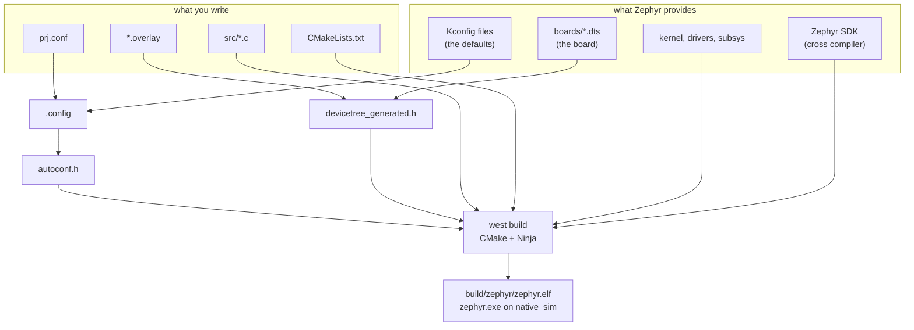

# 00-hello

This project is just to test and ensure your toolchain works. You will build it and run
the executable. It does not produce any firmware to flash.

## What to learn here

- The Zephyr ecosystem in general: what west, Kconfig, devicetree and the Zephyr SDK
  each do. See [Trivia](#trivia) below.
- What a minimal Zephyr application is made of: `CMakeLists.txt`, `prj.conf`, `src/`.
- Building with `west build -b <board>`, using `west build -b native_sim/native` here,
  and getting familiar with the native_sim board.
- Familiarizing with Kconfig: how `CONFIG_BOARD_TARGET` comes to be, and why the string
  it prints is not in any source file.
- That `prj.conf` is a list of Kconfig symbols, not a config file the app reads at run
  time. The build merges it into `build/zephyr/.config`, which is the file that actually
  decides what gets compiled.

## Layout

```
00-hello/
├── CMakeLists.txt          target_sources(app PRIVATE src/main.c)
├── prj.conf                just CONFIG_PRINTK=y
├── boards/
│   └── native_sim_native.conf   puts the console on stdin/stdout
└── src/main.c              two printk() calls
```

## Run it

```bash
cd apps/00-hello
```

```bash
west build -b native_sim/native -p
```

```bash
./build/zephyr/zephyr.exe
```

For a board you own:

```bash
west build -b nrf5340dk/nrf5340/cpuapp -p && west flash
```

## Expected outcome

```
*** Booting Zephyr OS build v4.4.2 ***
Hello from the Zephyr testing workshop!
Board: native_sim/native
```

The banner comes from Zephyr, not from `main()`. When selecting a board and getting it
flashed, the line will read out the board config name `nrf5340dk/nrf5340/cpuapp`,
`main.c` is unchanged.

There are no tests in this folder, so `west twister -T apps/00-hello` will fail as
expected, with `ERROR - No test cases found at the specified location`.

## Trivia

### The Zephyr ecosystem

Four things are involved in the build you just ran. They are easy to mix up, because
all four get steered from files sitting in this one folder.

| | |
|---|---|
| **west** | Zephyr's command line tool. It manages the repositories (`west update`), wraps CMake (`west build`), and calls the vendor flashing tools (`west flash`). It is not a compiler and not a build system, it drives both. |
| **Kconfig** | Decides which parts of Zephyr get compiled in. You write `prj.conf`, Zephyr's own Kconfig files supply the defaults, and the build merges the two. |
| **Devicetree** | Describes the hardware: which peripherals exist, on which pins, at which addresses. The board supplies a `.dts`, you add `.overlay` files on top. This app does not use it at all. App 01 onwards does. |
| **Zephyr SDK** | The cross compilers and binutils, one set per architecture. native_sim is the exception, it builds with your host compiler. |



Two generated files are worth knowing by name, both under `build/zephyr/`:

- **`.config`** is the merged Kconfig result. When you want to know whether a `CONFIG_`
  symbol is actually enabled, look here, not in `prj.conf`. Your `prj.conf` is one
  input out of many, and a symbol can be turned on by something else in Zephyr even
  when you never asked for it. The first exercise in [`EXERCISE.md`](EXERCISE.md) walks
  into exactly that.
- **`include/generated/zephyr/autoconf.h`** is `.config` turned into `#define` lines.
  This is the file the C compiler actually reads, and it is where
  `CONFIG_BOARD_TARGET` becomes a string literal your `main.c` can print.

### native_sim

`native_sim` compiles Zephyr into an ordinary Linux executable for the machine you are
sitting at. It is not an emulator like QEMU, there is no simulated CPU: the kernel and
your application are compiled for your host and run as a normal process. That is why
the artifact is called `zephyr.exe` and why it starts instantly.

What you get:

- No hardware needed. Anyone who can clone the repo can run the same thing.
- A build and run cycle in seconds, instead of a flash cycle.
- Host tooling works normally: `gdb`, `valgrind`, AddressSanitizer, UBSan.
- It runs in CI on a plain GitHub runner, with no board attached.

What you do not get:

- Real peripherals. Anything that talks to hardware will not compile, unless it gets
  recreated by emulating that specific hardware peripheral.
- Real timing. `k_sleep()` is honoured against the host clock, but nothing here tells
  you whether an ISR meets its deadline on a Cortex-M.

Almost every app in this repo runs on native_sim, including every test in CI. The board
overlays under `boards/` are what let the same `src/` build for native_sim and for a
real board without changing a line of C. Console options, including the pseudo-terminal
mode, are in [`docs/reference/native-sim.md`](../../docs/reference/native-sim.md).

## References

| | |
|---|---|
| [Application development](https://docs.zephyrproject.org/latest/develop/application/index.html) | what the three files are and what west does with them |
| [West](https://docs.zephyrproject.org/latest/develop/west/index.html) | the tool itself, and the difference between `west build` and plain CMake |
| [native_sim](https://docs.zephyrproject.org/latest/boards/native/native_sim/doc/index.html) | the board that is your laptop, including the console options in `boards/native_sim_native.conf` |
| [Kconfig](https://docs.zephyrproject.org/latest/build/kconfig/index.html) | why `CONFIG_PRINTK=y` is a build-time decision and not a runtime one |
| [`docs/setup/first-run.md`](../../docs/setup/first-run.md) | setup, if this app did not run |
