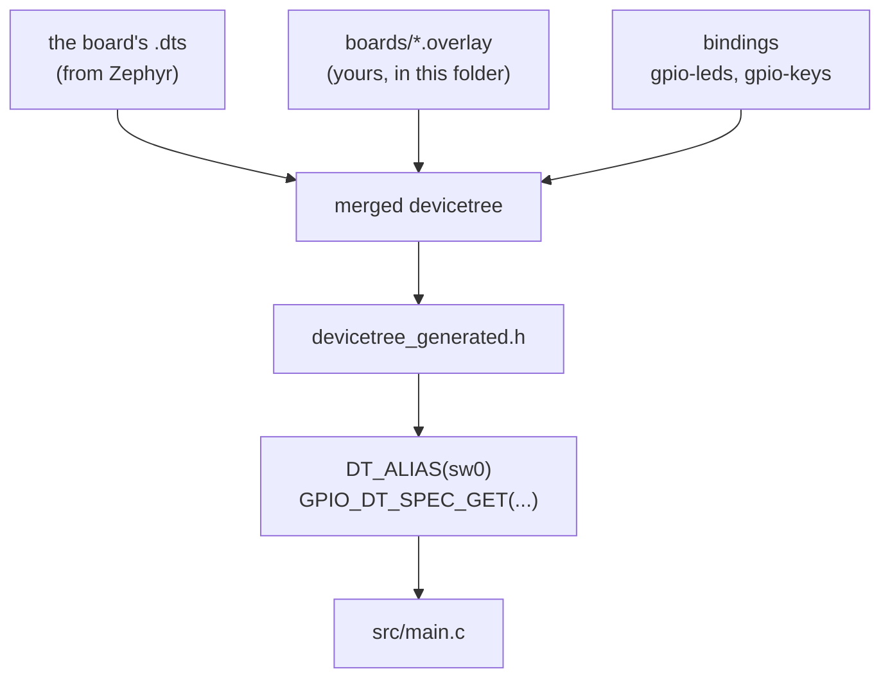

# 01-blinky

This project is a button toggling an LED, through a GPIO interrupt callback. You will
build it and run it, on native_sim and on a real board if you have one. On native_sim
it prints its banner and then sits there, because there is no button on your laptop to
press.

**What changed since `00-hello`:** the app now binds devicetree nodes. `sw0` and
`led0` are aliases, and which pins they land on is decided by `boards/*.overlay`, not
by anything in `src/`.

## What to learn here

- Devicetree in general: what a `.dts`, an `.overlay` and a binding each are, and how
  they end up as macros your C can use. See [Trivia](#trivia) below.
- What a devicetree alias is, and why the application asks for `sw0` instead of for a
  pin number.
- `GPIO_DT_SPEC_GET` and what it produces at compile time: a port, a pin and a flags
  word, all resolved before the program runs.
- Familiarizing with GPIO polarity: why `GPIO_ACTIVE_LOW` in an overlay means
  `gpio_pin_get_dt()` can return 1 while the pin is at 0 volts.
- Why this file is hard to test. Every decision here is mixed in with a driver call,
  so there is no function a test could call on its own. App 02 does something about
  that.

## Layout

```
01-blinky/
├── CMakeLists.txt
├── prj.conf                  CONFIG_GPIO=y
├── boards/                   one overlay per board, all providing sw0 and led0
│   ├── native_sim_native.overlay      gpio_emul, so the app builds off-target
│   ├── nrf5340dk_nrf5340_cpuapp.overlay
│   ├── esp32s3_devkitc_esp32s3_procpu.overlay
│   └── ...
└── src/main.c                everything: init, callback, state, printk
```

## Run it

```bash
cd apps/01-blinky
```

```bash
west build -b native_sim/native -p
```

```bash
./build/zephyr/zephyr.exe
```

On a board:

```bash
west build -b nrf5340dk/nrf5340/cpuapp -p && west flash
```

## Expected outcome

On `native_sim`:

```
*** Booting Zephyr OS build v4.4.2 ***
GPIO Button + LED Toggle started
Ready. Press the button to toggle LED.
```

Then nothing else, because nothing can press the emulated button yet. Apps 02 and 03
are where that gets solved.

On a board, pressing the button gives you:

```
Button pressed! LED is now ON
Button pressed! LED is now OFF
```

There are still no tests in this folder, so `west twister -T apps/01-blinky` finds
nothing.

## Trivia

### Devicetree

Kconfig decides which code gets compiled. Devicetree decides what hardware that code
believes it is talking to. Both are build-time, and neither is read at run time.

| | |
|---|---|
| **`.dts`** | The board. Zephyr ships one per board, describing every peripheral, pin and address. You do not edit it. |
| **`.dtsi`** | An include file the `.dts` pulls in, usually the SoC definition shared by every board using that chip. |
| **`.overlay`** | Your changes on top. Anything in `boards/*.overlay` here is merged over the board's own `.dts`. This is where you add an LED that Zephyr does not know you soldered on. |
| **binding** | A YAML schema that says which properties a node of a given `compatible` may have. `gpio-leds` and `gpio-keys` are the two used here. |
| **alias** | A name that points at a node, so code can say `sw0` instead of `&gpio0 11`. |



The generated header is at
`build/zephyr/include/generated/zephyr/devicetree_generated.h`. It is large and
machine-written, but it is readable, and searching it for `sw0` is the fastest way to
answer "which pin did I actually get". The first exercise in
[`EXERCISE.md`](EXERCISE.md) does that.

Overlay files are picked up by name. `boards/nrf5340dk_nrf5340_cpuapp.overlay` is
applied when you build for that board and ignored otherwise, which is why one `src/`
serves every board in the list without an `#ifdef`.

### Active low, and why the LED lies to you

A GPIO has an electrical level and a logical level, and the overlay decides how they
relate. `gpio_pin_set_dt(&led, 1)` means "make it active", not "drive it high".

| Flag in the overlay | "Active" means | So `gpio_pin_set_dt(&led, 1)` drives |
|---|---|---|
| `GPIO_ACTIVE_HIGH` | pin at 1 | high |
| `GPIO_ACTIVE_LOW` | pin at 0 | low |

The button in `boards/native_sim_native.overlay` is `GPIO_ACTIVE_LOW` with a pull-up,
which is the normal wiring for a button to ground: idle reads 1 electrically and
"not pressed" logically, and pressing pulls it to 0.

This matters more than it looks once you start writing tests. A test that drives the
emulated pin has to pick a raw level, and hardcoding `0` bakes the wiring into the
test. `apps/03-emul-gpio` reads the polarity back out of `button.dt_flags` instead, so
flipping the overlay does not break the suite.

## References

| | |
|---|---|
| [Devicetree guide](https://docs.zephyrproject.org/latest/build/dts/index.html) | start with "Introduction to devicetree", then "Devicetree HOWTOs" |
| [Devicetree bindings](https://docs.zephyrproject.org/latest/build/dts/bindings.html) | where `gpio-leds` and `gpio-keys` are defined, and what properties they accept |
| [GPIO API](https://docs.zephyrproject.org/latest/hardware/peripherals/gpio.html) | `gpio_pin_configure_dt`, `gpio_pin_interrupt_configure_dt`, and the active-low flag |
| [`DT_ALIAS`](https://docs.zephyrproject.org/latest/build/dts/api/api.html#c.DT_ALIAS) | and why `zephyr,user` is the other common way to do this |
| [Blinky sample](https://docs.zephyrproject.org/latest/samples/basic/blinky/README.html) | upstream's version, which this one is a button-driven variant of |
