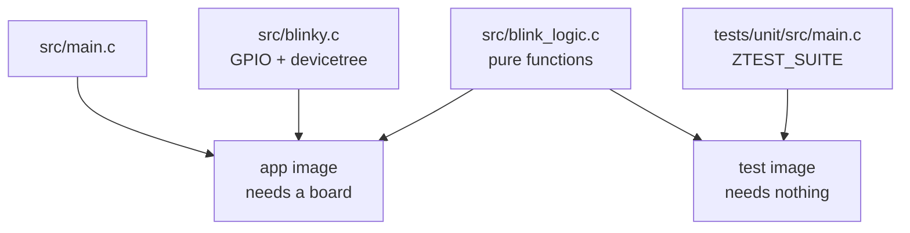

# 02-ztest

This project is the same button and LED as `01-blinky`, with the decision logic pulled
out into its own file and a ztest suite pointed at it. You will build the app, then run
the test suite with twister. The test itself never touches a GPIO.

**What changed since `01-blinky`:**

- `src/main.c` shrank to a `main()` that calls `blinky_init()`.
- `src/blink_logic.{c,h}` is new. Two pure functions, no Zephyr headers.
- `src/blinky.{c,h}` is new. All the driver code that used to be in `main.c`.
- `tests/unit/` is new.

## What to learn here

- What a ztest suite actually is: a second Zephyr application that happens to link
  some of your app's sources. See [Trivia](#trivia) below.
- What a seam is, concretely. `blink_logic_toggle()` takes a bool and returns a bool,
  so a test needs no board, no driver and no devicetree to call it.
- What `tests/unit/CMakeLists.txt` links, and what it leaves out. `blinky.c` is
  absent, so no GPIO driver is pulled in at all.
- Familiarizing with twister: how it finds a suite without a registry, what a scenario
  name is, and where it puts the logs.
- `ZTEST_SUITE`, `ZTEST`, and what `zassert_str_equal` buys you over `zassert_equal`
  on two `char *`.

## Layout

```
02-ztest/
├── src/
│   ├── main.c              calls blinky_init(), then sleeps
│   ├── blinky.{c,h}        GPIO, callback, devicetree. Not linked by the test.
│   └── blink_logic.{c,h}   THE SEAM. Pure functions, zero dependencies.
└── tests/
    └── unit/
        ├── CMakeLists.txt  links src/main.c of the TEST plus blink_logic.c
        ├── prj.conf        CONFIG_ZTEST=y
        ├── testcase.yaml   scenario app02.blink.logic
        └── src/main.c      ZTEST_SUITE + three ZTESTs
```

## Run it

```bash
cd apps/02-ztest
```

The application:

```bash
west build -b native_sim/native -p && ./build/zephyr/zephyr.exe
```

The test suite:

```bash
west twister -T apps/02-ztest -p native_sim
```

Or build and run the suite by hand, which is worth doing once so you can see what
twister is doing for you:

```bash
west build -b native_sim/native -p -s apps/02-ztest/tests/unit -d build_unit && ./build_unit/zephyr/zephyr.exe
```

## Expected outcome

Twister:

```
INFO    - 1 test scenarios (1 configurations) selected
...
INFO    - 1 of 1 executed test configurations passed (100.00%)
```

The scenario is `app02.blink.logic`. Running the test binary directly shows the three
tests by name, plus the `TC_PRINT` lines from `test_five_presses_from_off`:

```
Running TESTSUITE blink_logic
===================================================================
START - test_five_presses_from_off
press 1: LED is now ON
press 2: LED is now OFF
...
 PASS - test_five_presses_from_off
```

The application itself behaves exactly as `01-blinky` did, and still does nothing on
`native_sim`, because nothing can press the emulated button yet.

## Trivia

### A test suite is just another application

`tests/unit/` has its own `CMakeLists.txt`, its own `prj.conf` and its own
`src/main.c`. It is a complete Zephyr application. The only unusual thing about it is
that it sets `CONFIG_ZTEST=y`, which replaces the normal `main()` with ztest's runner,
and that it reaches back up into `../../src/` for the one file it wants to test.

That is the whole trick. Two builds come out of one `src/` directory, and each one
links a different subset:



The right-hand build has no GPIO driver in it, no devicetree node to bind and nothing
to emulate, which is why it runs anywhere and finishes in milliseconds. The price is
that it can only tell you about `blink_logic.c`. App 03 is about widening that.

### How twister finds this

Twister walks the tree looking for `testcase.yaml`, so there is no registry to keep up
to date and no place to forget to register a suite. That is the reason tests live next
to the app they test rather than in one big `tests/` directory at the repo root.

Each key under `tests:` in that file is a **scenario**, and the name is what you see in
the summary and what `--test` matches on:

```yaml
tests:
  app02.blink.logic:          # the scenario name
    platform_allow:
      - native_sim
    tags:
      - blink
      - unit
```

Results land in `twister-out/`, one directory per platform and scenario. The two files
worth knowing:

- **`build.log`** for anything that did not compile.
- **`handler.log`** for what the device actually printed while running.

When a run goes red, those are the answer far more often than the console summary is.

## References

| | |
|---|---|
| [ztest](https://docs.zephyrproject.org/latest/develop/test/ztest.html) | `ZTEST_SUITE`, `ZTEST`, and the whole `zassert_*` family |
| [Twister](https://docs.zephyrproject.org/latest/develop/test/twister.html) | `testcase.yaml` keys, especially `platform_allow` and `tags` |
| [`docs/NOTES-testing.md`](../../docs/NOTES-testing.md) | the local notes on both of the above |
| [apps/07-unit-conventions](../07-unit-conventions) | fixtures, table-driven cases and naming, once you want more than three tests |
