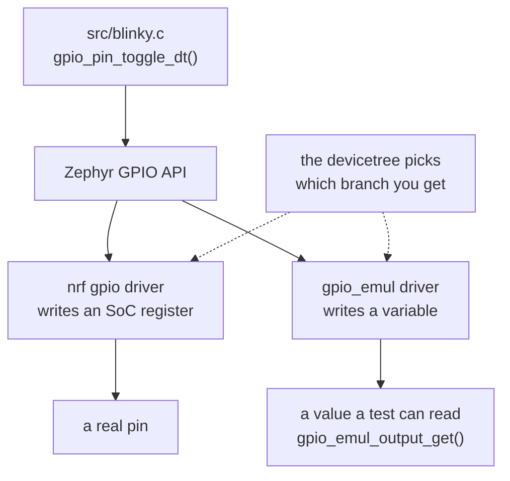

# 03-emul-gpio

This project runs the same five button presses as `02-ztest`, except this time they go
through the real GPIO driver, the real interrupt callback and the real `blinky.c`. You
will run two suites instead of one. Nothing in `src/` changed to make that possible.

**What changed since `02-ztest`:** one new directory, `tests/emul/`. Zero changed files
in `src/`. Check it yourself:

```bash
diff -r apps/02-ztest/src apps/03-emul-gpio/src
```

## What to learn here

- What an emulated driver is and where it sits in the stack, which is underneath your
  code rather than instead of it. See [Trivia](#trivia) below.
- What a test-only `app.overlay` is: a devicetree fragment belonging to the test
  application rather than to the app, which can reroute an alias the app binds without
  the app knowing.
- Why **both** aliases have to move. Reroute `sw0` and leave `led0`, and the first
  toggle from the callback runs against a controller this build never enabled. The
  comment in `tests/emul/app.overlay` is there because that failure shows up as a
  SIGSEGV with no useful message.
- `gpio_emul_input_set()` and `gpio_emul_output_get()`, which are how a test drives
  and reads a pin that does not exist.
- Why the suite uses `setup` and not `before`. `gpio_emul` fires registered callbacks
  straight out of `pin_configure()`, so re-running `blinky_init()` between tests looks
  exactly like a phantom button press.
- Why `pressed_raw_level()` reads polarity off `button.dt_flags` instead of hardcoding
  a 0.

## Layout

```
03-emul-gpio/
├── src/                      IDENTICAL to 02-ztest/src
└── tests/
    ├── unit/                 unchanged from 02-ztest: pure logic
    └── emul/                 NEW
        ├── app.overlay       gpio_emul controller + rerouted sw0 and led0
        ├── prj.conf          CONFIG_GPIO_EMUL=y
        ├── CMakeLists.txt    links blinky.c AND blink_logic.c this time
        ├── testcase.yaml     scenario app03.blink.emul
        └── src/main.c        presses the pin, reads the other pin
```

## Run it

```bash
cd apps/03-emul-gpio
```

```bash
west twister -T apps/03-emul-gpio -p native_sim
```

One suite at a time:

```bash
west twister -T apps/ -p native_sim --test app03.blink.emul
```

The app itself still runs:

```bash
west build -b native_sim/native -p && ./build/zephyr/zephyr.exe
```

## Expected outcome

Two scenarios, both green:

```
INFO    - 2 test scenarios (2 configurations) selected
...
INFO    - 2 of 2 executed test configurations passed (100.00%)
```

`app03.blink.logic` and `app03.blink.emul`. The second one prints its five presses
through `TC_PRINT`:

```
START - test_presses_toggle_the_led
press 1: LED level 1
press 2: LED level 0
press 3: LED level 1
press 4: LED level 0
press 5: LED level 1
 PASS - test_presses_toggle_the_led
```

Those levels are read back off an emulated output pin, not returned from a function.
Nothing in `src/` knows the difference.

## Trivia

### Where the fake goes

An emulator does not replace your code and it does not replace the driver API. It
replaces the thing at the bottom that would otherwise need real silicon. Everything
above it is the same code that ships:



The dashed line is where the choice happens. Your C never makes it. The `sw0` and
`led0` aliases resolve to whichever controller the merged devicetree put them on, and
`tests/emul/app.overlay` is what moves them onto `gpio_emul` for this one build.

### Overlays that belong to a test

An `app.overlay` sitting in `tests/emul/` applies to the test application only. The
app in `src/` never sees it, and neither does any other suite. So a test can invent
hardware:

```
                 sw0, led0 point at         sw0, led0 point at
                 the board's gpio0          emul_gpio
                        ▲                          ▲
 boards/*.overlay ──────┘                          └────── tests/emul/app.overlay
 (used by the app build)                    (used by the test build only)
```

That is why the suite has to move **both** aliases. They are moved by two separate
lines, and moving one is a perfectly valid overlay that produces a build which
compiles, links, and dies on the first `gpio_pin_toggle_dt()`.

### What `gpio_emul` does not model

It is a variable with callbacks attached, so it gets pin levels, interrupt edges and
pull-ups right. It knows nothing about drive strength, slew rate, contact bounce,
current limits, or two things driving the same net. This suite will pass through every
one of those, so that list is how you decide what still has to run on a board.

## References

| | |
|---|---|
| [Emulators](https://docs.zephyrproject.org/latest/hardware/emulator/bus_emulators.html) | the framework, and the list of what Zephyr already emulates |
| [`gpio_emul`](https://docs.zephyrproject.org/latest/hardware/peripherals/gpio.html) | the driver source at `$ZEPHYR_BASE/drivers/gpio/gpio_emul.c` is short and worth reading |
| [Devicetree overlays](https://docs.zephyrproject.org/latest/build/dts/howtos.html#set-devicetree-overlays) | which overlay files get picked up, and in what order |
| [apps/06-sensor](../06-sensor) | the same trick one layer down, on an I2C bus, with a chip Zephyr does not ship an emulator for |
