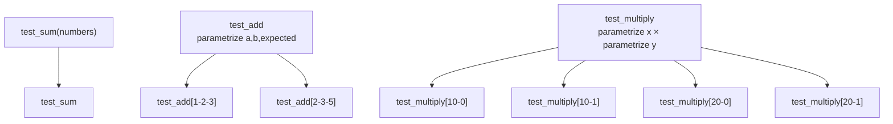
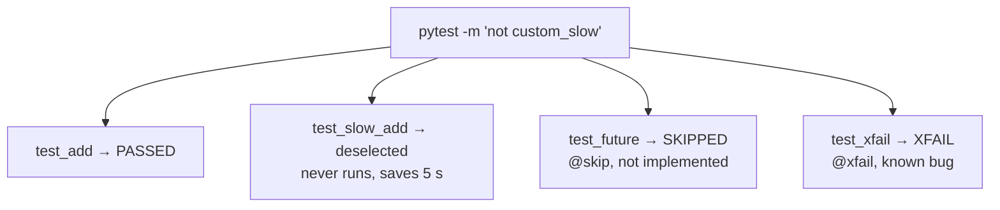

# 04-pytest-basics

This project is a set of plain pytest examples, with no Zephyr in them. You will run
each numbered folder with `pytest` from inside that folder. It does not build any
firmware, and Twister does not pick it up, since there is no `testcase.yaml` here.

**What changed since `03-emul-gpio`:** there is no device at all. Every folder is
Python only, so the pytest ideas that app 05 uses on a running Zephyr image can be
tried here first, in seconds.

## What to learn here

- How pytest finds and runs tests: files named `test_*.py`, functions named `test_*`,
  and a plain `assert` that pytest rewrites to show both sides when it fails.
- Fixtures: a function decorated with `@pytest.fixture` that pytest calls for you and
  passes in by argument name.
- `@pytest.mark.parametrize`, and stacking two of them to get every combination. See
  [Trivia](#trivia) below.
- Keeping code in `src/` and tests in `tests/`, and the two ways used here to let the
  tests import from `src/`.
- Markers: a custom `custom_slow` marker registered in `pytest.ini`, plus `skip` and
  `xfail`, and selecting tests with `-m`. App 05 uses the same idea with a `slow`
  marker passed through Twister.

## Layout

```
04-pytest-basics/
├── 1_bareminimum/test_bareminimum.py   plain asserts, one failing line commented out
├── 2_fixture/test_fixture.py           a fixture, parametrize, stacked parametrize
├── 3_foldering_conftest/
│   ├── src/calc.py
│   └── tests/conftest.py               puts src/ on sys.path at runtime
├── 3_foldering_project/
│   ├── pyproject.toml                  pythonpath = ["src"], no conftest.py
│   ├── src/calc.py
│   └── tests/test_calc.py
└── 4_marking/
    ├── pytest.ini                      registers the custom_slow marker
    ├── src/slow_calc.py                add(), a slow_add() that sleeps 5 s, a wrong_add()
    └── tests/test_calc.py              custom_slow, skip, xfail
```

## Run it

Run each folder from inside it, since pytest picks the rootdir and the config file from
where it starts.

```bash
cd apps/04-pytest-basics/1_bareminimum
```

```bash
pytest -v
```

The same `pytest -v` works in `2_fixture`, `3_foldering_conftest` and
`3_foldering_project`. In `4_marking`, also try leaving the slow test out:

```bash
pytest -v -m "not custom_slow"
```

## Expected outcome

```
== 1_bareminimum
test_bareminimum.py::test_addition PASSED                                [ 50%]
test_bareminimum.py::test_string PASSED                                  [100%]
============================== 2 passed in 0.04s ===============================
== 2_fixture
test_fixture.py::test_sum PASSED                                         [ 14%]
test_fixture.py::test_add[1-2-3] PASSED                                  [ 28%]
test_fixture.py::test_add[2-3-5] PASSED                                  [ 42%]
test_fixture.py::test_multiply[10-0] PASSED                              [ 57%]
test_fixture.py::test_multiply[10-1] PASSED                              [ 71%]
test_fixture.py::test_multiply[20-0] PASSED                              [ 85%]
test_fixture.py::test_multiply[20-1] PASSED                              [100%]
============================== 7 passed in 0.06s ===============================
== 3_foldering_conftest
tests/test_calc.py::test_add PASSED                                      [100%]
============================== 1 passed in 0.10s ===============================
== 3_foldering_project
configfile: pyproject.toml
tests/test_calc.py::test_add PASSED                                      [100%]
============================== 1 passed in 0.16s ===============================
== 4_marking
configfile: pytest.ini
tests/test_calc.py::test_add PASSED                                      [ 25%]
tests/test_calc.py::test_slow_add PASSED                                 [ 50%]
tests/test_calc.py::test_future SKIPPED (not implemented yet)            [ 75%]
tests/test_calc.py::test_xfail XFAIL (known bug)                         [100%]
=================== 2 passed, 1 skipped, 1 xfailed in 5.34s ====================
```

With `-m "not custom_slow"` in `4_marking`, the slow test is left out and the run takes
a fraction of a second:

```
============ 1 passed, 1 skipped, 1 deselected, 1 xfailed in 0.11s =============
```

## Trivia

### Where the 7 tests in 2_fixture come from

Three functions give seven tests. Each `parametrize` multiplies the function it sits
on, and stacking two of them gives every combination:



`pytest --collect-only -q` prints exactly this list, so you can check what a stack of
decorators turned into without running anything.

### Two ways to import from src/

Both `3_foldering_*` folders solve the same problem: getting `from calc import add` to
work when `calc.py` lives in `src/`. `3_foldering_conftest` adds `src/` to `sys.path`
from `conftest.py` at runtime. `3_foldering_project` does the same from config, with
`pythonpath = ["src"]` under `[tool.pytest.ini_options]` in `pyproject.toml`, and has
no `conftest.py` at all.

### What -m does in 4_marking



`-m` filters before anything runs, so a deselected test only appears as a count in the
summary line (`1 deselected`). `skip` and `xfail` are decided per test and show up as
their own results.

## References

| | |
|---|---|
| [Get started](https://docs.pytest.org/en/stable/getting-started.html) | test discovery, the first test, and how assert failures are reported |
| [How to use fixtures](https://docs.pytest.org/en/stable/how-to/fixtures.html) | requesting a fixture by argument name, scopes, and `conftest.py` |
| [How to parametrize](https://docs.pytest.org/en/stable/how-to/parametrize.html) | `@pytest.mark.parametrize`, stacking, and `ids=` |
| [How to mark test functions](https://docs.pytest.org/en/stable/how-to/mark.html) | registering custom markers and selecting them with `-m` |
| [Good integration practices](https://docs.pytest.org/en/stable/explanation/goodpractices.html) | `src/` layouts, import modes and the `pythonpath` setting |
| [`apps/05-shell-pytest`](../05-shell-pytest) | the same markers and `-m`, used on a running Zephyr image through Twister |
