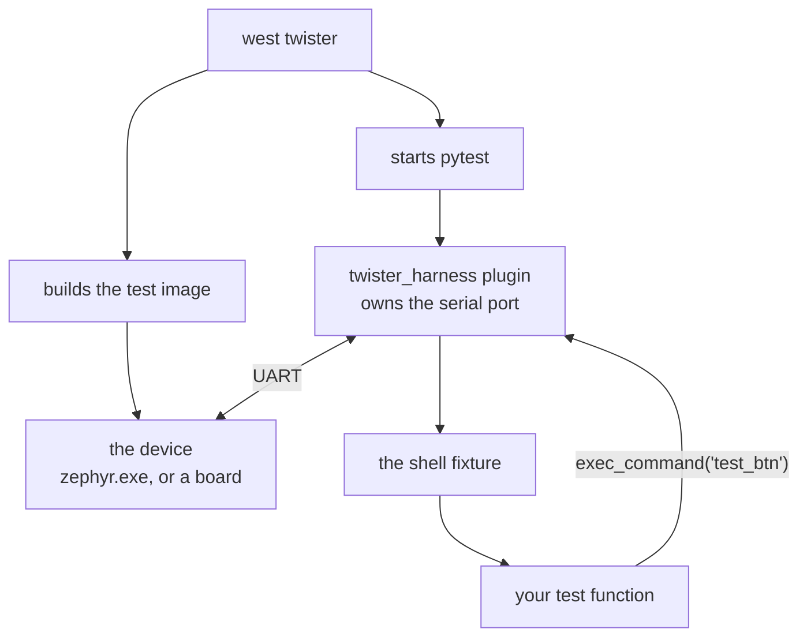

# 04-shell-pytest

This project adds a shell command that the device exposes only in its test build, and
a `pytest` suite that drives it from outside. You will run the suite against
native_sim, and against a real board if you have one and a `hardware-map.yaml` filled
in. The test process and the device are two separate programs here.

**What changed since `03-emul-gpio`:** the app went back to a flat `main.c` with no
seam, and the test moved out of the device entirely. The suite sits in
`tests/drivers/gpio_button_toggle/pytest/` and talks over a UART.

## What to learn here

- How the pieces connect: twister builds and flashes, `twister_harness` owns the
  serial port, and your pytest file only sees a fixture. See [Trivia](#trivia) below.
- Using a `shell` fixture that lets the same test file run whether the device is a
  native_sim process or a board on a runner.
- Why `test_harness.c` is a separate file from `src/main.c`. The shell command is
  compiled into the test image only, so the backdoor never ships.
- That `harness: pytest` in `testcase.yaml` is the entire opt-in, and that
  `harness: shell` next to it does plain string matching with no Python involved.
- Why `CONFIG_SHELL_VT100_COLORS=n` is in `prj.conf`. Colour escape codes are
  invisible to you and very visible to `str.find()`.
- What this buys you over ztest: the assertions run on a machine that can reach a
  network, a database and a file system.

## Layout

```
04-shell-pytest/
├── src/main.c                      flat app, no seam, no shell commands
├── hardware-map.yaml               probe serial + port, for --device-testing
└── tests/drivers/gpio_button_toggle/
    ├── app.overlay                 gpio_emul + rerouted sw0 and led0
    ├── prj.conf                    CONFIG_SHELL=y, CONFIG_GPIO_EMUL=y
    ├── test_harness.c              THE BACKDOOR. test_btn shell command.
    ├── testcase.yaml               harness: pytest
    └── pytest/test_gpio_toggle.py  five presses, asserted from outside
```

## Run it

```bash
cd apps/04-shell-pytest
```

```bash
west twister -T apps/04-shell-pytest -p native_sim
```

Against a board, after editing `hardware-map.yaml` with your own probe serial and
serial port:

```bash
west twister -T apps/04-shell-pytest --device-testing --hardware-map hardware-map.yaml
```

On ESP32-S3 add `--flash-before`, or the harness holds a stale descriptor after the
USB peripheral re-enumerates.

## Expected outcome

```
INFO    - 1 test scenarios (1 configurations) selected
...
INFO    - 1 of 1 executed test configurations passed (100.00%)
```

The scenario is `drivers.gpio.button_toggle`. The interesting output is in
`twister-out/native_sim/.../handler.log`, which holds everything the device said,
including the shell prompt and the echo of each `test_btn`.

When the test fails, you can find out what the exact failure was by looking there.

## Trivia

### Who runs what

Up to now the test and the thing under test were the same binary. Here they are not,
and it is worth being clear about which process does which job:



Your test file never opens a port, never resets a board and never knows which of the
two it got. The harness handles all of that, so the same file runs on your laptop and
on a runner with hardware attached.

The other fixture worth knowing is `dut`, the raw device adapter underneath `shell`.
`shell` sends a command and waits for the prompt, so it can only see output that came
back from a command. `dut` can read anything the device printed, including the boot
banner. `apps/05-pytest-advanced` uses both.

### Why the backdoor is a separate file

`test_harness.c` is listed in the test's `CMakeLists.txt` and nowhere else, so the
shell command exists in the test image and in no other build. `src/main.c` is
byte-identical between the two.

That split is not just tidiness. A shell that can drive your hardware is a real attack
surface, and the only version of "it is only in the test build" that holds up is the
one the build system enforces.

### The cheaper option next door

`testcase.yaml` has a commented-out `harness: shell` block. It sends commands and
checks that the output contains a string, with no Python anywhere:

```yaml
harness: shell
harness_config:
  shell_commands:
    - command: "test_btn"
      expected: "Test: Triggering emulated button press"
```

That is often enough. Reach for pytest when you need to compute an expected value,
parametrize over inputs, keep state between commands, or talk to something outside the
device. `apps/05-pytest-advanced` is all four.

## References

| | |
|---|---|
| [`docs/PYTEST_GUIDE.md`](../../docs/PYTEST_GUIDE.md) | local notes on `twister_harness`, the `dut` and `Shell` fixtures |
| [Twister pytest harness](https://docs.zephyrproject.org/latest/develop/test/pytest.html) | the fixtures, and what `harness_config` accepts |
| [Shell subsystem](https://docs.zephyrproject.org/latest/services/shell/index.html) | `SHELL_CMD_REGISTER`, subcommand sets, and the argument count checks |
| [apps/05-pytest-advanced](../05-pytest-advanced) | fixtures, parametrization, markers, and the same thing with no twister at all |
