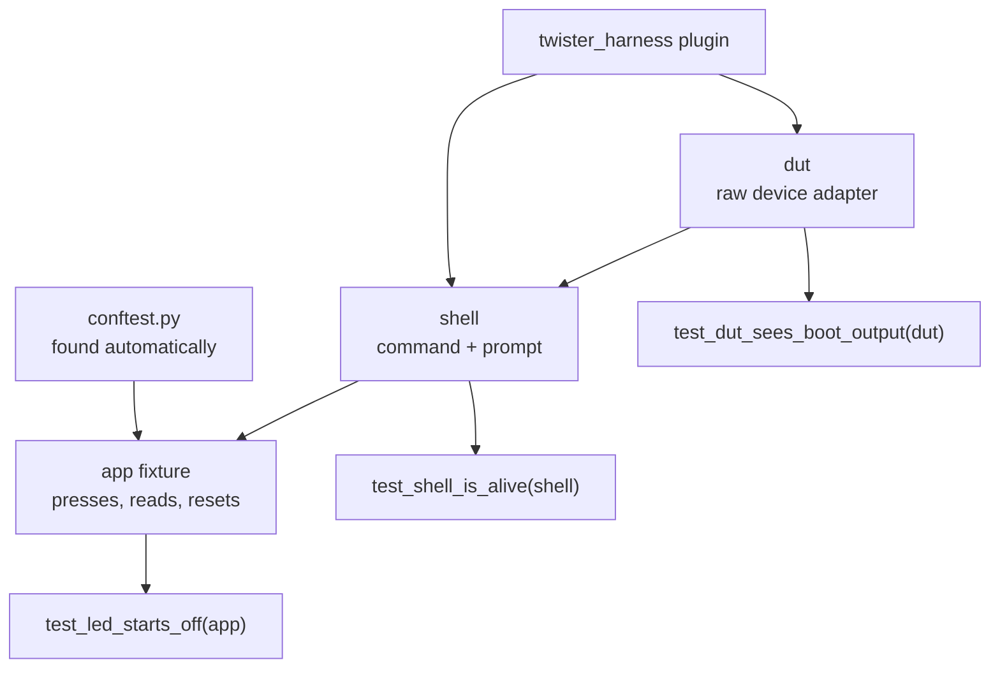

# 05-pytest-advanced

This project takes the backdoor from `04-shell-pytest` and builds a real pytest suite
on top of it: fixtures, parametrization, markers and expected failures. You will run
three twister scenarios over one directory, and then run the same assertions again with
no twister at all, so you can see what the harness was doing for you.

**What changed since `04-shell-pytest`:**

- `src/app_state.h` is new. The app exports state, and still registers no shell
  commands of its own.
- `tests/shell_pytest/test_harness.c` grew a subcommand set, and prints
  machine-readable `key=value` lines alongside the human ones.
- `tests/shell_pytest/testcase.yaml` has three scenarios over one directory.
- `tests/pytest_raw/` is new. Plain pytest against the native_sim binary.

## What to learn here

- How pytest assembles a test before it runs it: `conftest.py`, fixture resolution and
  scopes. See [Trivia](#trivia) below.
- Why `key=value` output exists. Asserting on free-text `printk` lines works for one
  test and breaks twenty the first time someone rewords a log line.
- `@pytest.mark.parametrize` with `ids=`, and why one result per case beats a loop that
  stops at the first failure.
- Markers, and `pytest_args` in `testcase.yaml` selecting on them, so the fast half of
  the suite can run in a pre-commit hook.
- `xfail(strict=True)` as a way to write an assumption down, so the day the behaviour
  changes, something tells you.
- Familiarizing with `dut` versus `shell`, and using `readlines_until()` instead of
  `time.sleep()`.
- What `tests/pytest_raw/conftest.py` had to grow in order to replace the harness.

## Layout

```
05-pytest-advanced/
├── src/
│   ├── main.c              press counter added; still no shell commands here
│   └── app_state.h         the read-only window the backdoor gets
└── tests/
    ├── shell_pytest/
    │   ├── test_harness.c  app btn|led|stats|reset, key=value output
    │   ├── testcase.yaml   THREE scenarios: smoke, full, shell-only
    │   └── pytest/
    │       ├── conftest.py         markers, parse_kv(), the app fixture
    │       ├── test_smoke.py       the three assertions worth having
    │       ├── test_parametrize.py parametrize, ids, negative cases
    │       ├── test_fixtures.py    dut vs shell, yield teardown, regex
    │       └── test_markers.py     skip, xfail(strict), conditional skip
    └── pytest_raw/         NO twister. Plain pytest, subprocess, pipes.
        ├── pytest.ini
        ├── conftest.py     a device adapter in sixty lines
        └── test_native_binary.py
```

## Run it

```bash
west twister -T apps/05-pytest-advanced -p native_sim
```

Just the fast half:

```bash
west twister -T apps/ -p native_sim --test app05.shell.pytest.smoke
```

The raw suite needs the test image built first, because there is no harness to build it
for you:

```bash
west build -b native_sim/native -p -s apps/05-pytest-advanced/tests/shell_pytest -d apps/05-pytest-advanced/tests/shell_pytest/build
```

```bash
cd apps/05-pytest-advanced/tests/pytest_raw && pytest
```

## Expected outcome

Three scenarios from `tests/shell_pytest/testcase.yaml`:

| Scenario | What it runs |
|---|---|
| `app05.shell.pytest.smoke` | the whole pytest directory, slow cases deselected |
| `app05.shell.pytest.full` | the whole directory, slow cases included |
| `app05.shell.builtin_harness` | `harness: shell`, no Python |

`smoke` and `full` build the same image and differ only in `pytest_args`, which is what
the `slow` marker is for. To narrow a scenario to one file instead, `pytest_root` is in
[`docs/reference/pytest-harness.md`](../../docs/reference/pytest-harness.md).

One test fails and reports as **xfail**:
`test_reset_also_turns_the_led_off`. It is `strict=True`, so if somebody makes
`app reset` clear the LED, that test starts failing and you go delete it.

The raw suite will give a message naming the missing binary if you have not built the
image yet.

```
INFO    - 3 of 3 executed test configurations passed (100.00%)
INFO    - 47 of 47 executed test cases passed (100.00%)
```

## Trivia

### How pytest assembles a test

A pytest test function is not called with the arguments you wrote. pytest reads the
parameter names, looks up a fixture for each one, builds those first, and passes the
results in. Fixtures can ask for other fixtures, so what you get is a small dependency
graph resolved per test:



`conftest.py` is found by directory, not by import. Any test file in that folder or
below can use a fixture defined there without importing anything, which is why none of
the test files has an import for `app`.

The `app` fixture is the one worth copying into your own suites. It wraps `shell` so
tests say `app.press(3)` instead of `shell.exec_command('app btn 3')`. When the
command spelling changes you edit one class, not twenty tests.

### key=value, and why the firmware prints twice

`test_harness.c` prints both a human line and a machine line:

```
Test: triggering 3 emulated button press(es)
btn=done count=3
```

The first is what you want on a serial console. The second is what pytest parses.
Keeping them separate means somebody can reword the human line without breaking the
suite, and `parse_kv()` in `conftest.py` turns the second into a dict the assertions
can talk about.

### `shell` and `dut` share one buffer

The two fixtures are not independent. `Shell` wraps the same `DeviceAdapter` the `dut`
fixture hands you, and both read from one buffer. Two consequences, and both of them
bite the first time:

- **Asking for `shell` consumes the boot banner.** It drains the buffer while waiting
  for its first prompt. A test that takes both fixtures and then goes looking for the
  banner finds nothing. `test_dut_sees_boot_output` asks for `dut` alone for exactly
  that reason.
- **`exec_command()` consumes the response.** It reads until the prompt comes back, so
  a `readlines_until()` afterwards has nothing left to match.
  `test_dut_readlines_until` writes the command with `dut.write()` instead.

There is a third one that is not about buffers at all. `dut` is function-scoped, so a
session-scoped fixture may not depend on it. pytest raises `ScopeMismatch` at setup
rather than at collection, so you find out when you run, not when you write.

### What twister was doing for you

`tests/pytest_raw/` gets to the same assertions with no twister and no
`twister_harness`. Reading the two `conftest.py` files side by side is the exercise,
but the short version is that the raw one had to grow a subprocess, a reader thread,
a prompt parser and a timeout, in about sixty lines, and it still only works against
native_sim.

## References

| | |
|---|---|
| [Twister pytest harness](https://docs.zephyrproject.org/latest/develop/test/pytest.html) | `pytest_root`, `pytest_args`, and the `dut` / `shell` / `mcumgr` fixtures |
| [pytest fixtures](https://docs.pytest.org/en/stable/how-to/fixtures.html) | scopes, `yield` teardown, and why `conftest.py` is found automatically |
| [pytest parametrize](https://docs.pytest.org/en/stable/how-to/parametrize.html) | `ids=`, stacking decorators, and indirect parametrization |
| [pytest markers](https://docs.pytest.org/en/stable/how-to/mark.html) | `--strict-markers`, and why registering markers is worth the two lines |
| [`docs/reference/pytest-harness.md`](../../docs/reference/pytest-harness.md) | the fixtures, their scope, and the one buffer `shell` and `dut` share |
