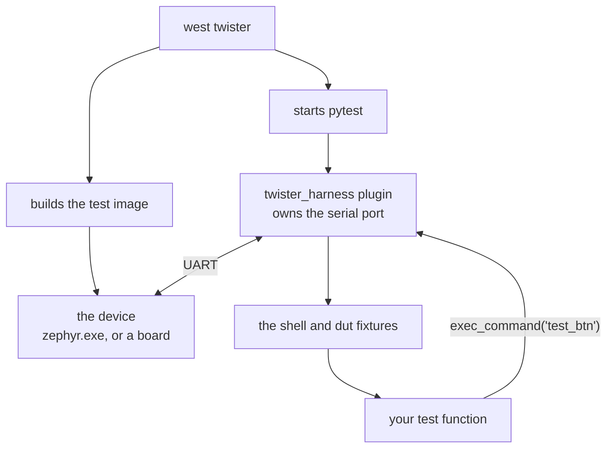
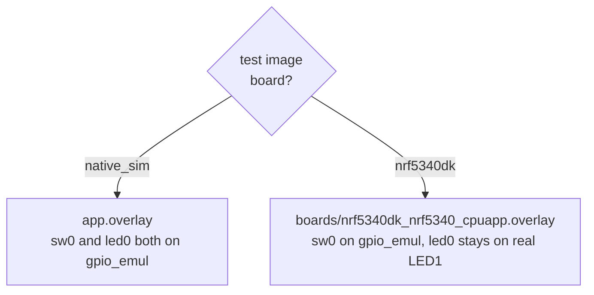

# 05-shell-pytest

This project is a Zephyr button and LED app, plus a pytest suite that presses the
button through a shell command that only exists in the test build. You will run the
suite with Twister on native_sim, and on a real board if you have one and a
`hardware-map.yaml` filled in. The test process and the device are two separate
programs here, and the shell command never ends up in the app firmware.

**What changed since `04-pytest-basics`:** the pytest side uses the same ideas as app
04 (a test file, a marker registered in `pytest.ini`, `-m`), now pointed at a running
Zephyr image through Twister's `shell` and `dut` fixtures. The app is written in C++.

## What to learn here

- How the pieces connect: Twister builds and flashes, `twister_harness` owns the serial
  port, and your pytest file only sees a fixture. See [Trivia](#trivia) below.
- Why `test_harness.c` is a separate file from `src/main.cpp`. The `test_btn` shell
  command is compiled into the test image only, so the backdoor never ships.
- Pressing the button through `gpio_emul`: the test overlay moves `sw0` onto an
  emulated GPIO controller, and `test_btn` drives that pin with `gpio_emul_input_set`.
- The `shell` fixture's `exec_command`, and `readlines_until` for output that arrives
  after the prompt.
- The `slow` marker from `pytest/pytest.ini`, selected through Twister with
  `--pytest-args="-m slow"`.
- That the same pytest file runs on native_sim and on an nRF5340 DK.

## Layout

```
05-shell-pytest/
├── src/main.cpp                    toggles led0 on every sw0 edge, prints the LED state
├── boards/                         led0 / sw0 aliases per board
├── hardware-map.yaml               probe serial + port, for --device-testing
├── tests/emul_button_toggle/
│   ├── app.overlay                 gpio_emul + rerouted sw0 and led0, used by native_sim
│   ├── boards/                     nRF5340 DK overlay, moves only sw0
│   ├── prj.conf                    CONFIG_SHELL=y, CONFIG_GPIO_EMUL=y
│   ├── test_harness.c              the test_btn shell command, test image only
│   ├── testcase.yaml               harness: pytest
│   └── pytest/
│       ├── pytest.ini              registers the slow marker
│       └── test_gpio_toggle.py     two presses through shell, one slow, one through dut
└── exercises/ex3-broken-e2e/       the same test against a main.cpp with one bug
```

`exercises/` holds a copy of the test with one bug in its `src/main.cpp`.
[`EXERCISE.md`](EXERCISE.md) has the command to run it.

## Run it

```bash
west twister -T apps/05-shell-pytest/tests/emul_button_toggle -p native_sim
```

Only the slow test:

```bash
west twister -T apps/05-shell-pytest/tests/emul_button_toggle -p native_sim --pytest-args="-m slow"
```

Against a board, after editing `hardware-map.yaml` with your own probe serial and
serial port:

```bash
west twister -T apps/05-shell-pytest/tests/emul_button_toggle --device-testing --flash-before --hardware-map apps/05-shell-pytest/hardware-map.yaml
```

`--flash-before` flashes the board before the harness opens the serial port. On the
ESP32-S3, flashing and the console share one USB port, and without it the chip boots
into download mode.

## Expected outcome

```
INFO    - 1 test scenarios (1 configurations) selected, 0 configurations filtered (0 by static filter, 0 at runtime).
INFO    - 1 of 1 executed test configurations passed (100.00%), 0 built (not run), 0 failed, 0 errored, with no warnings in 19.02 seconds.
INFO    - 3 of 3 executed test cases passed (100.00%) on 1 out of total 1473 platforms (0.07%).
```

The scenario is `app05.shell.pytest`. The pytest summary at the end of
`twister-out/native_sim_native/.../twister_harness.log` reads `3 passed in 7.65s`. With
`--pytest-args="-m slow"` it reads `1 passed, 2 deselected in 6.81s`.

`handler.log` in the same folder holds everything the device said:

```
*** Booting Zephyr OS build v4.4.0 ***
GPIO Button + LED Toggle started
Ready. Press the button to toggle LED.
uart:~$ test_btn
Test: Triggering emulated button press
Button pressed! LED is now ON
Button pressed! LED is now ON
uart:~$
uart:~$ test_btn
Test: Triggering emulated button press
Button pressed! LED is now OFF
Button pressed! LED is now OFF
uart:~$
```

On native_sim every `Button pressed!` line appears twice. The test only checks that the
line is there, so it passes either way.

When the test fails, you can find out what the exact failure was by looking at
`twister_harness.log`.

## Trivia

### Who runs what

The test and the thing under test are two different programs:



Your test file never opens a port, never resets a board and never knows which of the
two it got. The harness handles all of that, so the same file runs on your laptop and
on a runner with hardware attached.

`shell` sends a command and reads until the prompt comes back. `dut` is the raw device
adapter underneath it, and can read anything the device printed.
`test_button_toggle_dut` writes `test_btn` with `dut.write` and reads with
`dut.readlines_until`, without the shell fixture.

### When the LED line arrives after the prompt

`prj.conf` turns on logging, and `printk` goes through it. On native_sim the
`Button pressed!` line comes out before the shell prompt, so it is already in the lines
`exec_command` returns. On the nRF5340 DK, deferred logging can print it up to a second
later, after the prompt, so `exec_command` returns without it. Each shell test only
calls `readlines_until` when the line is not there yet:

```python
lines = shell.exec_command('test_btn')
if f'LED is now {expected}' not in '\n'.join(lines):
    lines += shell._device.readlines_until(regex=f'LED is now {expected}', timeout=2)
```

Calling `readlines_until` unconditionally fails on native_sim, because the line it waits
for was already read.

### Which overlay the test image gets

Zephyr stops looking once it finds `boards/<board>.overlay`, so on the DK that file
replaces `tests/emul_button_toggle/app.overlay` instead of adding to it:



On the DK only `sw0` moves, so LED1 blinks while pytest asserts on the log.

### The cheaper option next door

`testcase.yaml` has a commented-out `harness: shell` block. It sends commands and checks
that the output contains a string, with no Python anywhere:

```yaml
harness: shell
harness_config:
  shell_commands:
    - command: "test_btn"
      expected: "Test: Triggering emulated button press"
```

That is often enough. pytest is for when you need to compute an expected value,
parametrize over inputs, keep state between commands, or talk to something outside the
device.

## References

| | |
|---|---|
| [`docs/reference/pytest-harness.md`](../../docs/reference/pytest-harness.md) | `twister_harness`, the `dut` and `shell` fixtures, and `harness_config` |
| [Twister pytest harness](https://docs.zephyrproject.org/latest/develop/test/pytest.html) | the fixtures, `pytest_args`, and what `harness_config` accepts |
| [GPIO emulator](https://docs.zephyrproject.org/latest/doxygen/html/group__gpio__emul__interface.html) | `gpio_emul_input_set` and the rest of the emulator API used in `test_harness.c` |
| [Shell subsystem](https://docs.zephyrproject.org/latest/services/shell/index.html) | `SHELL_CMD_REGISTER`, subcommand sets, and the argument count checks |
| [`apps/04-pytest-basics`](../04-pytest-basics) | fixtures, parametrize and markers in plain Python, with no device |
