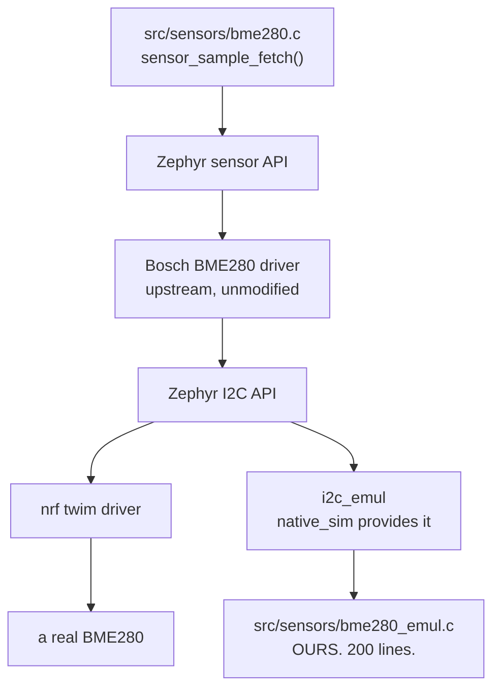

# 06-sensor

This project reads temperature, pressure and humidity from a BME280 over I2C, and
runs two test suites against it. You will build it and get live readings on your
laptop, with no sensor plugged in anywhere, because this repo ships an emulated BME280
that the real Bosch driver talks to over an emulated I2C bus.

**What changed since `03-emul-gpio`:** a real peripheral, a real vendor driver, and a
second seam. `climate_logic.c` is pure arithmetic with no Zephyr dependencies at all,
and `bme280.c` is the part that binds a devicetree node. The two get separate suites
for that reason.

## What to learn here

- Where an I2C emulator sits in the stack, and what each layer between your code and
  the fake chip is doing. See [Trivia](#trivia) below.
- What it takes to write an emulator for a part Zephyr does not cover: a register
  file, an I2C transfer callback, and a calibration blob that has to be
  self-consistent rather than merely non-zero.
- That `i2c_reg_write_byte_dt()` sends **one** message carrying `[reg, value]`, not
  two. Handling only the two-message shape is why a from-scratch emulator NAKs every
  write it is given.
- Why the humidity calibration is the easiest thing in the file to get wrong.
  `dig_h4` and `dig_h5` share the low and high nibbles of one byte.
- Why `tests/emul` mostly asserts properties rather than values, and keeps exactly one
  characterization test with literal numbers in it.
- `target_sources_ifdef(CONFIG_EMUL ...)`, which is how one source tree builds against
  a real chip on a board and against 200 lines of C on your laptop.

## Layout

```
06-sensor/
├── NOTES.md                board build/flash commands and a known UBSAN finding
├── src/
│   ├── hardware/           button.c, led.c
│   └── sensors/
│       ├── climate_logic.{c,h}  THE SEAM. Fixed-point and hysteresis, no Zephyr.
│       ├── bme280.{c,h}         binds DT_NODELABEL(bme280), runs a sensor thread
│       └── bme280_emul.{c,h}    THE FAKE CHIP. Built only when CONFIG_EMUL.
├── boards/                 native_sim adds a child node to the existing i2c0
└── tests/
    ├── unit/               app06.climate.logic  - links climate_logic.c only
    └── emul/               app06.climate.emul   - links bme280.c + the emulator
```

## Run it

```bash
cd apps/06-sensor
```

```bash
west build -b native_sim/native -p && ./build/zephyr/zephyr.exe
```

Both suites:

```bash
west twister -T apps/06-sensor -p native_sim
```

Board commands, including the ESP32 and nRF5340 variants, are in
[`NOTES.md`](NOTES.md).

## Expected outcome

Running the app on `native_sim`:

```
*** Booting Zephyr OS build v4.4.2 ***
System Started
System ready. Press button to toggle LED.
Initializing BME280 sensor...
BME280 sensor bme280@77 is ready!
T: 25080 mC | P: 100653 Pa | H: 65104 m%RH | ALARM OFF
```

Those numbers are not arbitrary. 25.08 degC and 100653 Pa are the published results of
the Bosch datasheet worked example for `adc_T = 519888` and `adc_P = 415148` against
the calibration blob in `bme280_emul.c`. The pressure lands on 100653 rather than
100656 because Zephyr's driver uses the 64-bit compensation path.

The readings repeat unchanged every two seconds, because the emulator holds fixed ADC
codes and nothing in the app varies them. Tests drive changes through
`bme280_emul_set_raw()`.

Both suites:

```
INFO    - 2 of 2 executed test configurations passed (100.00%)
```

## Trivia

### Five layers, one of them ours

`apps/03-emul-gpio` faked a pin. This one fakes a chip on a bus, which means more
layers, and only the bottom one is written by this repo:



The Bosch driver is the interesting part. It is not stubbed, not patched and not aware
of any of this. It sends the same register reads it would send to a real part, runs the
same fixed-point compensation over the calibration bytes it gets back, and produces the
datasheet's own answer. If the emulator's calibration blob were invented rather than
copied from the datasheet, the driver would still work and the readings would be
absurd, which is what the range assertions in `tests/emul` exist to catch.

Zephyr ships emulators for a handful of sensors already, `bmi160`, `bma4xx`, `f75303`
and others, but not for the BME280. Writing one is the exercise.

### Two suites, two questions

| Suite | Links | Answers |
|---|---|---|
| `tests/unit` | `climate_logic.c` only | is the fixed-point rounding right, does the hysteresis latch correctly |
| `tests/emul` | `bme280.c` + the emulator + the Bosch driver | does the app talk to this chip correctly |

They are separate because they fail for different reasons and run at different speeds.
`tests/unit` has no driver, no bus and no devicetree in it at all, so a failure there
is arithmetic and nothing else.

`tests/emul` deliberately asserts properties rather than values: readings in range,
temperature monotonic in the raw code, one channel not bleeding into another. There is
exactly one test with literal expected numbers, and it is labelled as a
characterization test. Pinning expected values everywhere would mean reimplementing
Bosch's compensation inside the test, at which point the test only checks your
arithmetic against itself.

### A known finding, left in on purpose

```bash
west twister -T apps/06-sensor -p native_sim --enable-asan --enable-ubsan
```

fails, inside upstream Zephyr, with a left shift of a negative value at `bme280.c:103`.
It is real, it is not caused by the emulator, and a physical BME280 would trip the same
check. [`NOTES.md`](NOTES.md) has the details. Deciding what you would do about a
finding like that in a vendor driver you do not own is more useful than a clean run.

## References

| | |
|---|---|
| [`NOTES.md`](NOTES.md) | board commands, the suite table, and the UBSAN finding inside the Bosch driver |
| [Emulator API](https://docs.zephyrproject.org/latest/hardware/emulator/index.html) | `EMUL_DT_INST_DEFINE` and the bus backend APIs |
| [`f75303_emul.c`](https://github.com/zephyrproject-rtos/zephyr/blob/main/drivers/sensor/renesas/f75303/f75303_emul.c) | the upstream emulator this one is modelled on |
| [`ina230_emul.c`](https://github.com/zephyrproject-rtos/zephyr/blob/main/tests/drivers/sensor/ina230/src/ina230_emul.c) | the precedent for shipping an emulator next to the test rather than upstream |
| [Sensor API](https://docs.zephyrproject.org/latest/hardware/peripherals/sensor.html) | `sensor_sample_fetch`, `sensor_channel_get`, and the `val1 + val2/1e6` convention |
| [BME280 datasheet](https://www.bosch-sensortec.com/products/environmental-sensors/humidity-sensors-bme280/) | section 4.2.3 is the worked example the numbers above come from |
