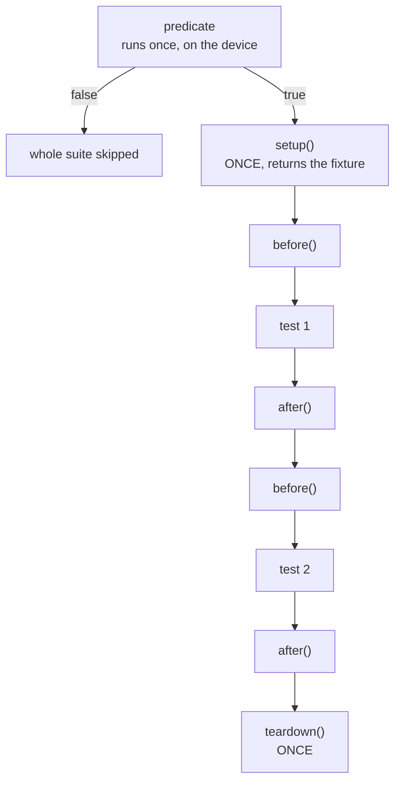

# 07-unit-conventions

This project is a feeding schedule for a pond feeder, and four ztest suites over it.
You will run the suites and then go argue with them in [`EXERCISE.md`](EXERCISE.md).
The module is deliberately small, because this app is about how the tests are written
rather than about what the code does.

**Where this sits:** apps 07, 08 and 09 form a second group. They assume you have found
the seam already, they can be read in any order, and none of them needs a board.

## What to learn here

- The ztest suite lifecycle: which hook runs once, which runs per test, and in what
  order. See [Trivia](#trivia) below.
- One behaviour per test, and why a test with four assertions about four different
  things reports one failure and hides three.
- Test names that state the behaviour. `test_next_feed_on_an_empty_schedule_fails`
  tells you what broke from the summary line alone. `test_next_2` makes you open the
  file.
- Arrange, Act, Assert, with a blank line between, so you can scan a suite instead of
  reading it.
- Assertion messages that print the offending value. `zassert_equal(got, want)` and
  `zassert_equal(got, want, "at minute %u got %u, want %u", now, got, want)` cost the
  same to type and tell you very different amounts when the test fails.
- That `ZTEST_F` requires the fixture type to be named `struct <suite>_fixture`,
  because the macro builds that name by token pasting.
- Table-driven cases as ztest's substitute for parametrization, and what they cost.
- `ztest_test_skip()` reporting SKIP rather than PASS, and a suite predicate as the
  run-time counterpart to `platform_allow`.

## Layout

```
07-unit-conventions/
├── src/
│   ├── feeder.{c,h}   four functions, no Zephyr headers
│   └── main.c         walks a clock through a day and prints, so the app runs
└── tests/
    └── ztest/
        ├── testcase.yaml   app07.feeder.ztest
        └── src/main.c      FOUR suites, one per convention being made
```

`feeder.c` is about forty lines. It holds up to four feeding times and answers one
question: how many minutes until the next feed. The only thing it does that is not
obvious is wrap past midnight, and that is where every interesting test comes from.

## Run it

```bash
west twister -T apps/07-unit-conventions -p native_sim
```

Run the test binary directly, which is worth doing once so you can see the suite and
test names ztest prints:

```bash
west build -b native_sim/native -p -s apps/07-unit-conventions/tests/ztest -d build_conv && ./build_conv/zephyr/zephyr.exe
```

The app itself:

```bash
cd apps/07-unit-conventions && west build -b native_sim/native -p && ./build/zephyr/zephyr.exe
```

## Expected outcome

One scenario, `app07.feeder.ztest`, containing four suites:

| Suite | What it demonstrates |
|---|---|
| `feeder_basic` | no fixture needed, AAA structure, naming |
| `feeder_edit` | `setup` / `before` / `after`, `ZTEST_F` |
| `feeder_timing` | a table of cases, and one case that earned its own test |
| `feeder_capacity` | a suite predicate and `ztest_test_skip()` |

```
INFO    - 1 of 1 executed test configurations passed (100.00%)
INFO    - 10 of 10 executed test cases passed (100.00%)
```

`feeder_capacity.test_skipped_when_the_schedule_is_odd` passes with the default
`FEEDER_SLOTS_MAX` of 4, because 4 is even. Set it to 3 and it reports SKIP, which is
warm-up 4 in [`EXERCISE.md`](EXERCISE.md).

The app prints a clock walking through the day in half-hour steps:

```
*** Booting Zephyr OS build v4.4.2 ***
Pond feeder, 3 slots configured
00:00  next feed in  360 min
00:30  next feed in  330 min
...
05:30  next feed in   30 min
06:00  next feed in    0 min   FEED NOW
06:30  next feed in  330 min
```

## Trivia

### The suite lifecycle

`ZTEST_SUITE` takes five function pointers after the name, and mixing up which runs
when is the most common source of a suite that passes in order and fails on its own:

```c
ZTEST_SUITE(name, predicate, setup, before, after, teardown);
```



The rule that falls out of it: **anything a test changes has to be put back in
`before`, not in `setup`.** `setup` runs once, so state one test dirtied is still
dirty for the next one.

**ztest runs the tests in a suite alphabetically**, not in the order you wrote them,
which is worth knowing before you reason about any of this. In `feeder_edit` that means
`test_adding_past_the_last_slot_is_rejected` runs last, after two tests that have each
already put a slot in the schedule.

Take `edit_before` out and that is the test that fails. What it catches it with is the
interesting part:

```
Assertion failed: (fixture->rejected not equal to (int)ARRAY_SIZE(times) - FEEDER_SLOTS_MAX)
FAIL - test_adding_past_the_last_slot_is_rejected
```

Not the count. `feeder_count()` is still 4, because the schedule is full either way, so
the obvious assertion sails through. Only the rejection tally notices that four adds
were refused instead of two.

The predicate is the odd one out. It is evaluated on the device at run time, which is
what makes it different from `platform_allow` in `testcase.yaml`. Use `platform_allow`
for "this board cannot build it" and a predicate for "this build does not have the
thing I need".

### Why a feeding schedule

Time of day is a small integer that wraps, and wrapping is where the bugs live.

A feed at 06:00 seen from 22:00 is eight hours away, not minus sixteen. These are
unsigned minutes, so the naive `slot - now` does not come out negative where you would
notice it, it comes out as 64576. `feeder_next()` adds a whole day before subtracting
for exactly that reason:

```c
uint16_t gap = (f->slots[i] + MINUTES_PER_DAY - now_minute) % MINUTES_PER_DAY;
```

What makes this worth a test rather than a careful read is how the broken version
fails. 64576 never beats the 1440 the search starts from, so the function does not
return anything strange. It returns 1440, the next feed is reported as a whole day
away, and the feeder quietly stops feeding after the last slot of the day. Two of the
six rows in `feeder_timing` catch it. The other four pass.

You would not find that by watching a feeder for an afternoon.

The same shape turns up anywhere a bounded counter wraps. Zephyr's own
`k_uptime_get_32()` rolls over every 49.7 days, and `k_cycle_get_32()` far faster than
that.

### What ztest does not have

There is no parametrization. A table plus a loop is the substitute, and it costs you
something real: the whole table reports as one test result, and it stops at the first
failure. Naming each row in the assertion message claws back most of the loss, but not
all of it.

`apps/09-gtest-gmock` has `TEST_P`, which is what the alternative looks like.

## References

| | |
|---|---|
| [ztest](https://docs.zephyrproject.org/latest/develop/test/ztest.html) | the hooks, the fixture naming rule, and every `zassert_*` |
| [ztest API reference](https://docs.zephyrproject.org/latest/develop/test/ztest.html#api-reference) | including `zassume_*`, which skips instead of failing |
| [Twister test cases](https://docs.zephyrproject.org/latest/develop/test/twister.html#test-cases) | how `testcase.yaml` names scenarios, and what tags are good for |
| [apps/08-fff-mocks](../08-fff-mocks) | what to do when the unit has dependencies |
| [apps/09-gtest-gmock](../09-gtest-gmock) | the same conventions in a framework that has real parametrization |
