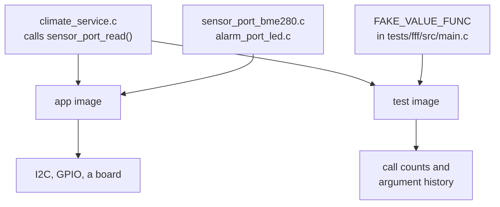

# 08-fff-mocks

This project tests a climate service by replacing the functions it calls, instead of
replacing the chip underneath it. You will run one suite of fourteen tests that has no
driver, no bus and no devicetree in it at all. The tool is FFF, the Fake Function
Framework, which Zephyr already vendors as `<zephyr/fff.h>`, so there is nothing to
install.

**What changed since `06-sensor`:** the same climate domain, restructured around two
port headers. `sensor_port.h` and `alarm_port.h` have declarations and no
implementation attached, and `climate_service.c` depends on nothing else.
`tests/fff/` links the service and defines those symbols itself.

## What to learn here

- The mechanism, which is link-time and smaller than it looks. See
  [Trivia](#trivia) below.
- What a fake records for you: `call_count`, `arg0_val`, `arg0_history[]`,
  `return_val`, `return_val_seq`, and `custom_fake` when the function communicates
  through an out-parameter.
- The assertion an emulator cannot make, which is "nothing ever tried to change it".
  An LED can only tell you its final state.
- That making a dependency misbehave is a one-line change here.
  `SET_RETURN_SEQ(sensor_port_read, seq, 4)` gives you two failures, a success and a
  failure, which is fiddly to arrange with an emulated BME280.
- Why the reset lives in a `FFF_FAKES_LIST` macro rather than as three `RESET_FAKE`
  lines.
- What this technique does **not** tell you. Every test here still passes with
  `sensor_port_bme280.c` deleted, and the last test in the file says so in its own
  name.

## Layout

```
08-fff-mocks/
├── src/
│   ├── sensor_port.h            THE SEAM. Declaration, no implementation.
│   ├── alarm_port.h             THE OTHER SEAM. Where the decision goes out.
│   ├── climate_service.{c,h}    THE UNIT UNDER TEST. Includes no Zephyr header.
│   ├── climate_logic.{c,h}      copied from 06-sensor, unchanged
│   ├── sensor_port_bme280.c     production impl, built when CONFIG_BME280
│   ├── sensor_port_sim.c        production impl, built otherwise
│   ├── alarm_port_led.c         production impl, an LED on the led0 alias
│   └── main.c                   the composition root, and the only file that
│                                knows about both halves
└── tests/
    └── fff/
        ├── CMakeLists.txt       read what it links, then what it does not
        ├── testcase.yaml        app08.climate.fff
        └── src/main.c           the fakes and fourteen tests
```

`tests/fff/prj.conf` has no `CONFIG_GPIO`, no `CONFIG_I2C` and no `CONFIG_SENSOR`.
Nothing under test touches a driver, so nothing enables one.

## Run it

```bash
west twister -T apps/08-fff-mocks -p native_sim
```

The app, with `src/sensor_port_sim.c` selected automatically because `CONFIG_BME280`
is off:

```bash
cd apps/08-fff-mocks && west build -b native_sim/native -p && ./build/zephyr/zephyr.exe
```

## Expected outcome

One scenario, `app08.climate.fff`, grouped into five sections in the source:

| Section | Tests |
|---|---|
| call counts | the sensor is read once; a quiet reading never touches the alarm |
| argument capture | the alarm is raised with `true`, on the edge only, in the right order |
| return sequences | errors counted, a raised alarm survives a read failure, three in a row latch a fault |
| stateful custom fake | a room warming up raises the alarm on the third tick |
| the limit | the one that says what none of the others prove |

The app prints a sawtooth and flips the alarm as it crosses 30 degC:

```
Climate service starting
T: 24500 mC | P: 100650 Pa | H: 56500 m%RH | ALARM OFF
...
alarm: ON
T: 30500 mC | P: 100650 Pa | H: 74500 m%RH | ALARM ON
```

> Not yet run in the devcontainer. `<zephyr/fff.h>` is on the include path whenever
> `CONFIG_ZTEST=y`, so there is nothing to add to `west.yml`, but treat the first run
> as part of the exercise.

## Trivia

### The mechanism is the linker

`sensor_port.h` declares three functions and defines none of them. In the app build,
`sensor_port_bme280.c` or `sensor_port_sim.c` supplies them. In the test build, those
files are simply not listed in `CMakeLists.txt`, so the symbols are undefined until
`FAKE_VALUE_FUNC` and `FAKE_VOID_FUNC` define them instead:



No `--wrap`, no weak symbols, no `#ifdef TEST` in production code. The only thing that
differs between the two columns is which files got compiled, and that is decided in
`CMakeLists.txt`.

This is also the constraint you have to design for. It works because
`climate_service.c` calls `sensor_port_read()` rather than `sensor_sample_fetch()`
directly. Zephyr's sensor API is `static inline` over an API struct, so there is no
symbol to replace, which is why the port header exists at all.

### What a fake is not

A fake is not an emulator and it does not know anything about a BME280. It knows that
something called it, how many times, with what, and what you told it to return. That is
enough to answer a class of questions an emulator is bad at:

| Question | Answer it with |
|---|---|
| does my code drive this chip correctly? | an emulator, `apps/06-sensor` |
| does my code do the right thing on three `-EIO` in a row? | a fake, this app |
| does it drive the alarm once per edge, not once per tick? | a fake, `call_count` |
| is the I2C address right? | neither. Only real hardware. |

A suite that has only one of these halves can pass while the product does not work.

## References

| | |
|---|---|
| [FFF](https://github.com/meekrosoft/fff) | the upstream README is the reference. Every macro it defines, on one page. |
| [`$ZEPHYR_BASE/subsys/testsuite/include/zephyr/fff.h`](https://github.com/zephyrproject-rtos/zephyr/blob/main/subsys/testsuite/include/zephyr/fff.h) | the vendored copy. Open it to see what the macros expand to. |
| [Zephyr tests using FFF](https://github.com/search?q=repo%3Azephyrproject-rtos%2Fzephyr+DEFINE_FFF_GLOBALS&type=code) | upstream suites doing the same thing, for convention |
| [apps/09-gtest-gmock](../09-gtest-gmock) | the same service, the same assertions, with gmock instead |
