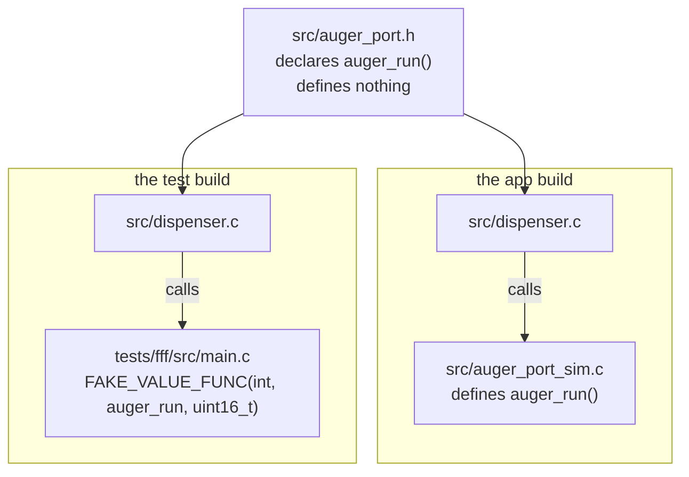

# 08-fff-mocks

This project is the part of a pond feeder that turns the motor, plus a ztest suite that
replaces the motor with a fake. You will run the suite and read what the fake recorded
about how it was called. There is no GPIO and no board overlay here, because nothing in
this app binds a devicetree node.

**What changed since `07-unit-conventions`:** the feeder in app 07 decides when to feed
and calls nothing. This one calls a motor, so its tests need something to stand in for
the motor.

## What to learn here

- Where a fake comes from: `src/auger_port.h` declares `auger_run()` and defines it
  nowhere, so the test file is free to define it instead. See [Trivia](#trivia) below.
- The four things FFF records for you: how many times a function was called, the
  argument on the last call, the argument on each call, and what it hands back.
- `SET_RETURN_SEQ`, for a dependency that fails once and then recovers. The same
  scenario with a real motor is a morning of work.
- Asserting that a function was **not** called. `test_zero_grams_never_reaches_the_motor`
  does nothing else.
- Why `tests/fff/CMakeLists.txt` deliberately leaves `src/auger_port_sim.c` out of the
  source list, and what the linker does about the missing symbol.
- What this kind of test cannot tell you, which is anything about whether the motor is
  wired to the right pin.

## Layout

```
08-fff-mocks/
├── src/
│   ├── auger_port.h        one function, declared and not defined
│   ├── dispenser.{c,h}     feed a portion, retry once on a jam
│   ├── auger_port_sim.c    the shipping implementation, jams every third call
│   └── main.c              feeds every second so the app runs
└── tests/
    └── fff/
        ├── CMakeLists.txt  read what is MISSING from target_sources
        ├── testcase.yaml   app08.dispenser.fff
        └── src/main.c      the fake, and four tests
```

## Run it

```bash
cd apps/08-fff-mocks
```

```bash
west build -b native_sim/native -p
```

```bash
./build/zephyr/zephyr.exe
```

```bash
west twister -T apps/08-fff-mocks -p native_sim -O /tmp/tw --clobber-output
```

The `-O /tmp/tw --clobber-output` part is only needed on a Windows bind mount. See
[`docs/troubleshooting.md`](../../docs/troubleshooting.md#twister).

## Expected outcome

The app, with the simulated auger jamming every third call:

```
*** Booting Zephyr OS build v4.4.2 ***
Pond feeder dispenser starting
auger: 250 g
feed -> 0 | total 250 g | jams 0
auger: 250 g
feed -> 0 | total 500 g | jams 0
auger: JAM
auger: 250 g
feed -> 0 | total 750 g | jams 0
```

The third feed took two turns and still succeeded, which is the retry in
`dispenser_feed()`.

The suite:

```
SUITE PASS - 100.00% [dispenser_fff]: pass = 4, fail = 0, skip = 0, total = 4
 - PASS - [dispenser_fff.test_a_jam_is_retried_and_the_feed_still_counts]
 - PASS - [dispenser_fff.test_feeding_runs_the_auger_once_with_the_portion_size]
 - PASS - [dispenser_fff.test_two_jams_give_up_and_dispense_nothing]
 - PASS - [dispenser_fff.test_zero_grams_never_reaches_the_motor]
```

Twister reports `1 of 1 executed test configurations passed` and
`4 of 4 executed test cases passed`.

## Trivia

### Where the fake comes from

`auger_run()` is declared in `src/auger_port.h` and defined in exactly one file,
`src/auger_port_sim.c`. The test build leaves that file out of `target_sources()`, so
the symbol is undefined until `tests/fff/src/main.c` defines it with `FAKE_VALUE_FUNC`.
The linker does not know or care which one it got.



No `--wrap`, no weak symbols, no `#ifdef TEST` in production code. The one requirement
is that `dispenser.c` calls `auger_run()` and not `gpio_pin_set_dt()` directly. A module
that reaches straight for a driver has nothing to substitute.

### What FFF gives you

For every function declared with `FAKE_VALUE_FUNC` or `FAKE_VOID_FUNC`:

| | |
|---|---|
| `<fn>_fake.call_count` | how many times it was called |
| `<fn>_fake.arg0_val` | the first argument on the last call |
| `<fn>_fake.arg0_history[i]` | the first argument on call `i` |
| `<fn>_fake.return_val` | what it returns, every time |
| `SET_RETURN_SEQ(<fn>, arr, n)` | a different return value per call, in order |
| `<fn>_fake.custom_fake` | your own function body, for out-parameters |
| `RESET_FAKE(<fn>)` | wipe all of the above |

FFF has no `EXPECT_CALL`. You call the code, then you read the counters and assert. The
`before` hook in the suite resets every fake, because a fake left holding yesterday's
`call_count` makes a test pass only when the whole suite runs in order.

`apps/09-gtest-gmock` does the same job with gmock, where the expectation is declared
before the call and checked for you.

### What a fake cannot tell you

Every test in `tests/fff` passes with `src/auger_port_sim.c` deleted. They pin what
`dispenser.c` does with the answers it gets, and nothing at all about whether the real
implementation drives the right pin at the right speed.

`apps/06-sensor` is the other half. It fakes the **chip**, an emulated BME280 on an
emulated I2C bus, with the real Bosch driver in between, and answers "does my code drive
this part correctly?". A fake port answers "does my code do the right thing when the
part returns `-EIO` twice in a row?". Both questions are real, and each technique is bad
at the other one.

## References

| | |
|---|---|
| [FFF on GitHub](https://github.com/meekrosoft/fff) | the README is the full API. Zephyr vendors this file as `<zephyr/fff.h>`. |
| [`$ZEPHYR_BASE/include/zephyr/fff.h`](https://github.com/zephyrproject-rtos/zephyr/blob/main/include/zephyr/fff.h) | the vendored copy. Open it to see what the macros expand to. |
| [Test doubles, Martin Fowler](https://martinfowler.com/bliki/TestDouble.html) | the vocabulary: stub, fake, spy, mock, and which one FFF makes |
| [`apps/06-sensor/README.md`](../06-sensor/README.md) | the emulator approach, for the same problem one level down |
| [`apps/09-gtest-gmock/README.md`](../09-gtest-gmock/README.md) | the same dispenser with gmock instead |
