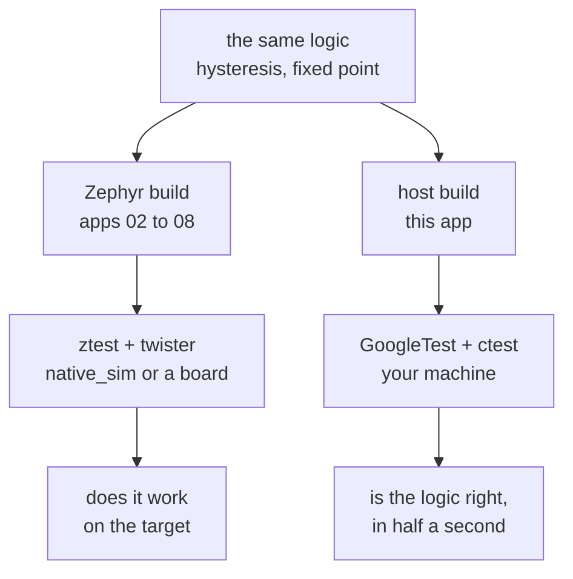

# 09-gtest-gmock

This project is not a Zephyr application. It is an ordinary host CMake project in
C++17, testing the same climate service that `08-fff-mocks` tests in C, with
GoogleTest and GoogleMock instead of ztest and FFF. You will configure it with `cmake`
and run it with `ctest`, and the whole suite finishes in about half a second. `west`
and `twister` are not involved at any point.

**What changed since `08-fff-mocks`:** the ports became abstract base classes and
arrive through the constructor instead of through the linker. The assertions are the
same ones, so you can read the two directories side by side.

## What to learn here

- Where a host test project sits relative to the Zephyr ones, and what it can and
  cannot tell you. See [Trivia](#trivia) below.
- Constructor injection versus link-time substitution. A vtable lets two
  implementations live in the same binary and lets each test hand the service a
  different one. FFF cannot, because there is exactly one symbol called
  `sensor_port_read` in a program.
- `EXPECT_CALL` declaring the expectation up front, with the mock failing the test at
  destruction if it was not met. FFF records, and you assert afterwards.
- `NiceMock`, the naggy default, and `StrictMock`. A bare mock warns about every
  uninteresting call and still passes, which is how a large gmock suite ends up with
  hundreds of warnings nobody reads.
- `DoAll(SetArgReferee<0>(r), Return(0))`, which is the gmock answer to the custom
  fake you hand-wrote in app 08.
- `TEST_P` with a name generator, and `PrintTo`, without which `ctest -N` shows you a
  hex dump of your parameter struct where the test name should be.
- `GTest::gmock_main`, not `gtest_main`. The wrong one links and runs, and your mocks
  silently stop verifying themselves.

## Layout

```
09-gtest-gmock/
├── CMakeLists.txt            plain CMake. No find_package(Zephyr).
├── include/climate/
│   ├── reading.hpp
│   ├── ports.hpp             ISensorPort, IAlarmPort. Pure virtual.
│   ├── logic.hpp             thresholds and two free functions
│   └── service.hpp           the unit under test
├── src/
│   ├── logic.cpp
│   ├── service.cpp           same behaviour as 08-fff-mocks, line for line
│   ├── sawtooth_sensor.hpp   a production impl, not a test double
│   └── main.cpp              a host demo binary
└── tests/
    ├── CMakeLists.txt
    ├── test_logic.cpp        TEST, TEST_P, TEST_F, matchers
    └── test_service.cpp      MOCK_METHOD, EXPECT_CALL, InSequence, Strict/Nice
```

There is no `testcase.yaml` anywhere under this folder, so `west twister -T apps/`
finds nothing here.

## Run it

```bash
cmake -S apps/09-gtest-gmock -B apps/09-gtest-gmock/build
```

```bash
cmake --build apps/09-gtest-gmock/build -j
```

```bash
ctest --test-dir apps/09-gtest-gmock/build --output-on-failure
```

The demo binary:

```bash
./apps/09-gtest-gmock/build/climate_demo
```

FetchContent downloads GoogleTest at configure time, which needs network exactly once.
If you are offline, clone it and point at your copy:

```bash
cmake -S apps/09-gtest-gmock -B apps/09-gtest-gmock/build -DGTEST_LOCAL_DIR=/path/to/googletest
```

Sanitizers:

```bash
cmake -S apps/09-gtest-gmock -B apps/09-gtest-gmock/build -DCLIMATE_SANITIZERS=ON
```

## Expected outcome

Verified on GCC 15.2 with CMake 4.2 and GoogleTest v1.15.2:

```
100% tests passed, 0 tests failed out of 30

Total Test time (real) =   0.48 sec
```

Thirty ctest entries, because `gtest_discover_tests` registers each `TEST` separately.
The nine parameterized cases come out named:

```
Test #22: Thresholds/AlarmHysteresis.MatchesTheTruthTable/cold and dry stays off
Test #23: Thresholds/AlarmHysteresis.MatchesTheTruthTable/exactly on the temp trip
```

Half a second for the whole suite, from a cold `ctest`. That number is the reason to
have a host suite at all.

## Trivia

### Two build systems, two questions

Nothing in this folder goes through `west`. The source is plain C++ compiled by your
host compiler, and CMake fetches GoogleTest at configure time:



Keeping both in one repo is a deliberate choice and it has a cost: the logic exists
twice, once in C and once in C++. In a real project you would pick one, or share the C
and wrap it. The reason both are here is so you can read
`tests/test_service.cpp` next to `apps/08-fff-mocks/tests/fff/src/main.c` and see the
same fourteen assertions written two ways.

### What you give up

- No kernel, no scheduler, no threads, no `k_sleep`.
- No devicetree, so nothing here can be wrong about a pin or an I2C address.
- No cross compiler, so the code is compiled for x86 with different integer promotion
  behaviour and different alignment from a Cortex-M.
- Nothing in this folder makes any claim about real hardware.

### What you get

- `gdb` with no probe, `ASan` and `UBSan` for the price of one CMake flag.
- Real parametrization, `TEST_P`, which ztest does not have.
- Mocks that fail at the moment of the unexpected call, with a stack trace, rather
  than at the end with a number.
- A suite fast enough to run on every save.

Most teams end up with a split roughly along this line: host tests for anything that is
arithmetic or state machines, ztest and emulators for anything that touches a driver,
and hardware in the loop for the rest. This app is the first of those three.

## References

| | |
|---|---|
| [GoogleTest primer](https://google.github.io/googletest/primer.html) | `TEST`, `TEST_F`, and the `EXPECT_` versus `ASSERT_` distinction |
| [Advanced GoogleTest](https://google.github.io/googletest/advanced.html) | `TEST_P`, `PrintTo`, death tests, and typed tests |
| [gMock for dummies](https://google.github.io/googletest/gmock_for_dummies.html) | the shortest path into `MOCK_METHOD` and `EXPECT_CALL` |
| [gMock cookbook](https://google.github.io/googletest/gmock_cook_book.html) | `NiceMock` / `StrictMock`, `DoAll`, `SetArgReferee`, and matchers |
| [gMock cheat sheet](https://google.github.io/googletest/gmock_cheat_sheet.html) | the one-page summary of matchers, actions and cardinalities |
| [apps/08-fff-mocks](../08-fff-mocks) | the same assertions in C, for comparison |
