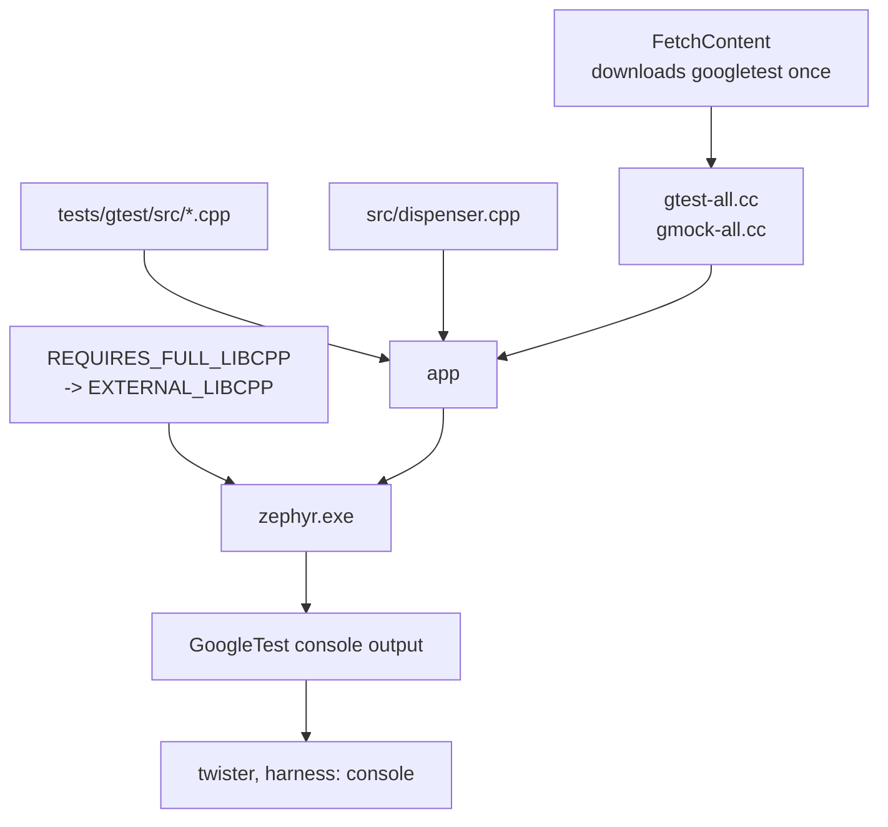

# 09-gtest-gmock

This project is the same pond feeder dispenser as `08-fff-mocks`, written in C++23, with GoogleTest and GoogleMock instead of ztest and FFF. You will build it
for native_sim and run the suite through twister, the same as every other app here. It
does not use ztest, so twister decides whether the run passed by reading the console.

**What changed since `08-fff-mocks`:** the auger became an abstract base class and
arrives through the constructor instead of through the linker. The behaviour under test
is the same, so you can open the two test files side by side.

## What to learn here

- Getting a third-party C++ test framework into a Zephyr build, and the Kconfig symbols
  it needs first. See [Trivia](#trivia) below.
- `CONFIG_REQUIRES_FULL_LIBCPP`, and why the symbol that looks right,
  `CONFIG_GLIBCXX_LIBCPP`, is silently discarded on native_sim.
- Constructor injection against link-time substitution. A vtable lets two
  implementations live in the same binary, so each test can hand the dispenser a
  different one. FFF cannot do that, because a program has exactly one symbol called
  `auger_run`.
- `EXPECT_CALL` declaring the expectation before the call, with the mock failing the
  test at destruction if it was not met. FFF records, and you assert afterwards.
- `TEST_P` with a name generator, which gives one result per row of a table. ztest has
  no parametrization, so a table there is one test with a loop inside it.
- `static_assert` over a `constexpr` function, checked while the file compiles and never
  run.
- `harness: console` in `testcase.yaml`, which is how twister runs a suite that is not
  ztest.

## Layout

```
09-gtest-gmock/
├── CMakeLists.txt            find_package(Zephyr), project(... CXX)
├── prj.conf                  CONFIG_CPP, CONFIG_STD_CPP2B, REQUIRES_FULL_LIBCPP
├── include/feeder/
│   ├── auger.hpp             IAuger, one pure virtual function
│   ├── portion.hpp           the Portion enum and two constexpr functions
│   └── dispenser.hpp         the unit under test
├── src/
│   ├── dispenser.cpp         same job as apps/08-fff-mocks/src/dispenser.c
│   ├── belt_auger.hpp        a shipping implementation, not a test double
│   └── main.cpp              the app. A Zephyr main() in C++.
└── tests/
    └── gtest/
        ├── CMakeLists.txt    fetches googletest, compiles it into the image
        ├── prj.conf          exceptions, RTTI, a full libstdc++, a big heap
        ├── testcase.yaml     harness: console, matching the [ PASSED ] line
        └── src/
            ├── main.cpp            InitGoogleMock, RUN_ALL_TESTS, nsi_exit
            ├── test_portion.cpp    TEST_P over a table, plus static_assert
            └── test_dispenser.cpp  MOCK_METHOD and EXPECT_CALL
```

## Run it

```bash
cd apps/09-gtest-gmock
```

```bash
west build -b native_sim/native -p
```

```bash
./build/zephyr/zephyr.exe
```

```bash
west twister -T apps/09-gtest-gmock -p native_sim -O /tmp/tw --clobber-output
```

The first build downloads googletest through `FetchContent`. On a machine with no
network, clone it once and point the build at it:

```bash
west build -b native_sim/native -p apps/09-gtest-gmock/tests/gtest -- -DGTEST_SRC_DIR=/path/to/googletest
```

## Expected outcome

The app feeds a large portion once a second. A 750 g portion is three turns of a 250 g
auger, and the simulated auger jams every seventh turn:

```
*** Booting Zephyr OS build v4.4.2 ***
Pond feeder dispenser starting
auger: 250 g
auger: 250 g
auger: 250 g
feed -> 0 | total 750 g | jams 0
auger: 250 g
auger: 250 g
auger: 250 g
feed -> 0 | total 1500 g | jams 0
auger: JAM
feed -> -5 | total 1500 g | jams 1
```

The suite, which twister reads off the console:

```
[       OK ] Dispenser.SplitsAPortionIntoWholeTurns (0 ms)
[       OK ] Dispenser.ZeroGramsNeverReachesTheMotor (0 ms)
[       OK ] Dispenser.AJamStopsTheRemainingTurns (0 ms)
[       OK ] Portion/TurnsFor.MatchesTheTable/NothingAsked (0 ms)
[       OK ] Portion/TurnsFor.MatchesTheTable/OnePelletStillCostsAWholeTurn (0 ms)
[       OK ] Portion/TurnsFor.MatchesTheTable/ExactlyOneTurn (0 ms)
[       OK ] Portion/TurnsFor.MatchesTheTable/OneOverRoundsUp (0 ms)
[       OK ] Portion/TurnsFor.MatchesTheTable/ALargePortion (0 ms)
[  PASSED  ] 8 tests.
```

Twister reports `1 of 1 executed test configurations passed`, and **one** test case, not
eight. `harness: console` gives one result for the whole binary.

## Trivia

### The same behaviour, two frameworks

`tests/gtest/src/test_dispenser.cpp` and
[`apps/08-fff-mocks/tests/fff/src/main.c`](../08-fff-mocks/tests/fff/src/main.c) cover
the same three questions. The difference is when the expectation gets written down.

| | FFF | gmock |
|---|---|---|
| declaring what you expect | after the call, by reading `auger_run_fake.call_count` | before the call, with `EXPECT_CALL` |
| an unmet expectation | nothing happens unless you wrote an assertion for it | fails the test when the mock is destroyed |
| returning different values per call | `SET_RETURN_SEQ(auger_run, arr, n)` | `.WillOnce(Return(0)).WillOnce(Return(-EIO))` |
| checking an argument | `zassert_equal(auger_run_fake.arg0_val, 250)` | `EXPECT_CALL(auger, run(250))`, part of the match |
| a call that should not happen | assert `call_count == 0` afterwards | `EXPECT_CALL(auger, run(_)).Times(0)` |
| what it costs to run | a header, no C++ runtime | exceptions, RTTI, a full standard library, 256 kB of heap |

The last row is the one that decides it on a real target.

### Getting GoogleTest into a Zephyr build

GoogleTest is not a Zephyr module, so `west` knows nothing about it and there is no
`CONFIG_GOOGLETEST` to set. The source has to be fetched and compiled into the image:



Two things in `tests/gtest/CMakeLists.txt` are there because the obvious version does
not work:

- It never calls `FetchContent_MakeAvailable`, which would run googletest's own
  `CMakeLists.txt`. That file sets its own C++ standard, warning flags and threading
  model, and all three then argue with Zephyr's.
- The gtest sources go straight into `app` rather than into their own
  `zephyr_library_named(googletest)`. The library version builds `libgoogletest.a`
  quite happily and then never links it, because a library declared in an application
  `CMakeLists.txt` does not end up in `ZEPHYR_LIBS`. The symptom is a few hundred
  undefined references to `testing::`.

### The Kconfig symbol that looks right and is not

`CONFIG_GLIBCXX_LIBCPP` is the obvious choice for "give me a real C++ standard
library". Upstream it says:

```
config GLIBCXX_LIBCPP
	depends on "$(TOOLCHAIN_HAS_GLIBCXX)" = "y"
	depends on NEWLIB_LIBC || PICOLIBC
```

native_sim uses neither libc, so Kconfig drops the symbol without a word and leaves
`MINIMAL_LIBCPP` in place. The first sign is a compile error that says nothing about
Kconfig:

```
tests/gtest/src/test_portion.cpp:11:10: fatal error: string: No such file or directory
```

The second sign is in the compiler command line, `-nostdinc++ -isystem
.../lib/cpp/minimal/include`, and the honest answer is in `build/zephyr/.config`, where
`CONFIG_GLIBCXX_LIBCPP` simply is not present and `CONFIG_MINIMAL_LIBCPP=y` is. This is
the same lesson [`apps/00-hello/EXERCISE.md`](../00-hello/EXERCISE.md) warm-up 2 sets up
with `CONFIG_PRINTK`, and it cost a build to relearn here.

The symbol that works on a native target is `CONFIG_REQUIRES_FULL_LIBCPP`, because:

```
choice LIBCPP_IMPLEMENTATION
	default EXTERNAL_LIBCPP if REQUIRES_FULL_LIBCPP && NATIVE_BUILD
```

`EXTERNAL_LIBCPP` has no libc dependency and means "link whatever standard library the
host toolchain has". Check it landed:

```bash
grep LIBCPP build/zephyr/.config
```

### The Kconfig symbols, and why each one is there

`tests/gtest/prj.conf` is longer than any other test in this repo. Every line earns its
place:

| Symbol | Needed because |
|---|---|
| `CONFIG_CPP` | there is C++ in the image at all |
| `CONFIG_STD_CPP2B` | `std::to_underlying` in `include/feeder/portion.hpp` is C++23 |
| `CONFIG_CPP_EXCEPTIONS` | GoogleTest throws to unwind out of a failed assertion in a subroutine |
| `CONFIG_CPP_RTTI` | the matcher machinery uses `dynamic_cast` |
| `CONFIG_REQUIRES_FULL_LIBCPP` | `std::string`, `std::vector` and streams, which gtest uses throughout |
| `CONFIG_HEAP_MEM_POOL_SIZE=262144` | every `TEST` and `EXPECT_CALL` allocates when it registers itself, before `main()` |
| `CONFIG_MAIN_STACK_SIZE=32768` | gtest's own frames are deep |

Work down that table when you want to know whether GoogleTest will run on your own
target. On native_sim the standard library is the host's and the heap is as big as you
ask for. On a Cortex-M with 64 kB of RAM, the last three rows are where it stops.

### Ending the run

`main()` returning does not end a native_sim process. The kernel carries on with the
idle thread, and the binary sits there until something kills it, which for twister means
waiting out the full timeout on every run. `tests/gtest/src/main.cpp` calls
`nsi_exit(failures)` from `<nsi_main.h>`, the native simulator's own shutdown, and
passes the GoogleTest failure count out as the process exit code.

ztest does this for you. It is one of several small things you give up by bringing your
own framework.

### Two harnesses, one twister

Every other test folder in this repo sets `CONFIG_ZTEST=y`, and twister then uses its
ztest harness: it knows the protocol, counts the suites and reports each test
separately. This folder has no ztest in it, so that route is closed.

`harness: console` is the general-purpose alternative. Twister runs the binary, reads
what comes out, and matches a regex:

```yaml
harness: console
harness_config:
  type: one_line
  regex:
    - '\[  PASSED  \] \d+ tests?\.'
```

One pass or fail for the whole binary rather than per test, which is the cost.
GoogleTest prints `[  FAILED  ]` and a non-zero count when anything breaks, so the line
never appears and twister reports the scenario as failed.

Note the single quotes. In a double-quoted YAML scalar a backslash starts an escape, so
`\[` is a parse error and you would have to write `\\[` instead.

## References

| | |
|---|---|
| [GoogleTest primer](https://google.github.io/googletest/primer.html) | `TEST`, `TEST_F`, the assertion macros, and the difference between `ASSERT_` and `EXPECT_` |
| [gMock for dummies](https://google.github.io/googletest/gmock_for_dummies.html) | `MOCK_METHOD`, `EXPECT_CALL`, and how a mock verifies itself |
| [gMock cheat sheet](https://google.github.io/googletest/gmock_cheat_sheet.html) | the one-page summary of matchers, actions and cardinalities |
| [Value-parameterized tests](https://google.github.io/googletest/advanced.html#value-parameterized-tests) | `TEST_P`, `INSTANTIATE_TEST_SUITE_P` and the name generator used in `test_portion.cpp` |
| [Zephyr C++ support](https://docs.zephyrproject.org/latest/develop/languages/cpp/index.html) | which parts of the standard library exist on which libc, and what `CONFIG_MINIMAL_LIBCPP` leaves out |
| [Twister harnesses](https://docs.zephyrproject.org/latest/develop/test/twister.html#harnesses) | `console`, `ztest`, `pytest` and the rest, and what `harness_config` takes |
| [`apps/08-fff-mocks/README.md`](../08-fff-mocks/README.md) | the same dispenser with FFF, in C |
