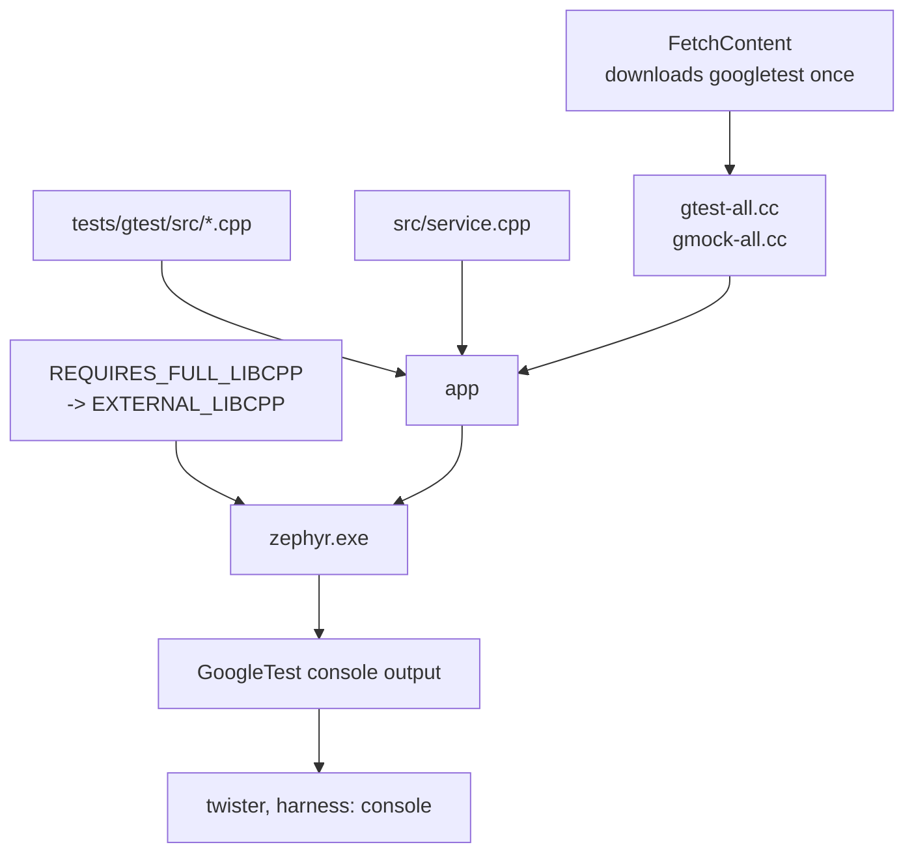

# 09-gtest-gmock

This project is the same climate service as `08-fff-mocks`, written in C++ at the 2b
standard, with GoogleTest and GoogleMock instead of ztest and FFF. You will build it
for native_sim and run the suite through twister, the same as every other app here. It
does not use ztest, so twister decides whether it passed by reading the console.

**What changed since `08-fff-mocks`:** the ports became abstract base classes and
arrive through the constructor instead of through the linker. The assertions are the
same ones, so you can read the two directories side by side.

## What to learn here

- Getting a third-party C++ test framework into a Zephyr build, and the four Kconfig
  symbols it needs first. See [Trivia](#trivia) below.
- `CONFIG_REQUIRES_FULL_LIBCPP`, and why the symbol that looks right,
  `CONFIG_GLIBCXX_LIBCPP`, is silently discarded on native_sim.
- `CONFIG_STD_CPP2B`, and what it turns on. `std::to_underlying` in
  `include/climate/logic.hpp` is C++23 and does not compile without it.
- Constructor injection versus link-time substitution. A vtable lets two
  implementations live in the same binary and lets each test hand the service a
  different one. FFF cannot, because a program has exactly one symbol called
  `sensor_port_read`.
- `EXPECT_CALL` declaring the expectation up front, with the mock failing the test at
  destruction if it was not met. FFF records, and you assert afterwards.
- `NiceMock`, the naggy default, and `StrictMock`. A bare mock warns about every
  uninteresting call and still passes, which is how a large gmock suite ends up with
  hundreds of warnings nobody reads.
- `DoAll(SetArgReferee<0>(r), Return(0))`, which is the gmock answer to the custom
  fake you hand-wrote in app 08.
- `TEST_P` with a name generator, and `PrintTo`, without which the parameterized cases
  print as a hex dump of your struct.
- Compile-time tests. Both functions in `logic.hpp` are `constexpr`, so eight of the
  assertions in `test_logic.cpp` are `static_assert` and never run at all.
- `harness: console` in `testcase.yaml`, which is how twister runs a suite that is not
  ztest.

## Layout

```
09-gtest-gmock/
├── CMakeLists.txt            find_package(Zephyr), project(... CXX)
├── prj.conf                  CONFIG_CPP, CONFIG_STD_CPP2B, REQUIRES_FULL_LIBCPP
├── boards/
│   └── native_sim_native.conf
├── include/climate/
│   ├── reading.hpp
│   ├── ports.hpp             ISensorPort, IAlarmPort, plus two concepts
│   ├── logic.hpp             constexpr thresholds and two constexpr functions
│   └── service.hpp           the unit under test
├── src/
│   ├── service.cpp           same behaviour as 08-fff-mocks, line for line
│   ├── sawtooth_sensor.hpp   a production impl, not a test double
│   └── main.cpp              the app. A Zephyr main() in C++.
└── tests/
    └── gtest/
        ├── CMakeLists.txt    fetches googletest, compiles it into the image
        ├── prj.conf          exceptions, RTTI, a full libstdc++, a big heap
        ├── testcase.yaml     harness: console, matching the [ PASSED ] line
        └── src/
            ├── main.cpp      InitGoogleMock, RUN_ALL_TESTS, nsi_exit
            ├── test_logic.cpp    static_assert, TEST, TEST_P, TEST_F, matchers
            └── test_service.cpp  MOCK_METHOD, EXPECT_CALL, InSequence, Strict/Nice
```

## Run it

```bash
cd apps/09-gtest-gmock
```

```bash
west build -b native_sim/native -p && ./build/zephyr/zephyr.exe
```

The suite:

```bash
west twister -T apps/09-gtest-gmock -p native_sim
```

Or build and run it directly, which is the faster loop while you are editing tests:

```bash
west build -b native_sim/native -p -s apps/09-gtest-gmock/tests/gtest -d build_gt && ./build_gt/zephyr/zephyr.exe
```

The first configure downloads googletest. On a machine with no network, clone it once
and point at your copy:

```bash
west build -b native_sim/native -p -s apps/09-gtest-gmock/tests/gtest -d build_gt -- -DGTEST_SRC_DIR=/path/to/googletest
```

## Expected outcome

The application:

```
*** Booting Zephyr OS build v4.4.2 ***
Climate service starting
T: 24500 mC | P: 100650 Pa | H: 56500 m%RH | ALARM OFF
T: 25000 mC | P: 100650 Pa | H: 58000 m%RH | ALARM OFF
```

The suite prints GoogleTest's own output and exits with code 0:

```
[----------] Global test environment tear-down
[==========] 30 tests from 4 test suites ran. (0 ms total)
[  PASSED  ] 30 tests.
```

That last line is what `testcase.yaml` matches on, so twister reports:

```
INFO    - 1 of 1 executed test configurations passed (100.00%)
```

The nine parameterized cases print with the names the generator gave them:

```
[ RUN      ] Thresholds/AlarmHysteresis.MatchesTheTruthTable/exactly_on_the_temp_trip
[       OK ] Thresholds/AlarmHysteresis.MatchesTheTruthTable/exactly_on_the_temp_trip (0 ms)
```

Thirty tests run in under a millisecond. The image they run in is **6.8 MB**, against
roughly 100 kB for the ztest suite in app 07, and the twister run takes about 90
seconds because almost all of it is compiling GoogleTest.

## Trivia

### Getting GoogleTest into a Zephyr build

GoogleTest is not a Zephyr module, so `west` knows nothing about it and there is no
`CONFIG_GOOGLETEST` to set. The source has to be fetched and compiled into the image:



Two things in `tests/gtest/CMakeLists.txt` are there because the obvious version does
not work:

- It never calls `FetchContent_MakeAvailable`, which would run googletest's own
  `CMakeLists.txt`. That file sets its own C++ standard, warning flags and threading
  model, and all three then argue with Zephyr's.
- The gtest sources go straight into `app` rather than into their own
  `zephyr_library_named(googletest)`. The library version builds `libgoogletest.a`
  quite happily and then never links it, because a library declared in an application
  `CMakeLists.txt` does not end up in `ZEPHYR_LIBS`. The symptom is a few hundred
  undefined references to `testing::`.

### The Kconfig symbol that looks right and is not

`CONFIG_GLIBCXX_LIBCPP` is the obvious choice for "give me a real C++ standard
library". Upstream it says:

```
config GLIBCXX_LIBCPP
	depends on "$(TOOLCHAIN_HAS_GLIBCXX)" = "y"
	depends on NEWLIB_LIBC || PICOLIBC
```

native_sim uses neither libc, so Kconfig drops the symbol without a word and leaves
`MINIMAL_LIBCPP` in place. The first sign is a compile error that says nothing about
Kconfig:

```
include/climate/ports.hpp:18:10: fatal error: concepts: No such file or directory
```

The second sign is in the compiler command line, `-nostdinc++ -isystem
.../lib/cpp/minimal/include`, and the honest answer is in `build/zephyr/.config`,
where `CONFIG_GLIBCXX_LIBCPP` simply is not present. This is the same lesson
[`apps/00-hello/EXERCISE.md`](../00-hello/EXERCISE.md) warm-up 2 sets up with
`CONFIG_PRINTK`, and it cost a build to relearn here.

The symbol that works on a native target is `CONFIG_REQUIRES_FULL_LIBCPP`, because:

```
choice LIBCPP_IMPLEMENTATION
	default EXTERNAL_LIBCPP if REQUIRES_FULL_LIBCPP && NATIVE_BUILD
```

`EXTERNAL_LIBCPP` has no libc dependency and means "link whatever standard library the
host toolchain has". Check it landed:

```bash
grep LIBCPP build/zephyr/.config
```

### The Kconfig symbols, and why each one is there

`tests/gtest/prj.conf` is longer than any other test in this repo. Every line earns
its place:

| Symbol | Needed because |
|---|---|
| `CONFIG_CPP` | there is C++ in the image at all |
| `CONFIG_STD_CPP2B` | `std::to_underlying` and the concepts in `ports.hpp` |
| `CONFIG_CPP_EXCEPTIONS` | GoogleTest throws to unwind out of a failed assertion in a subroutine |
| `CONFIG_CPP_RTTI` | the matcher machinery uses `dynamic_cast` |
| `CONFIG_REQUIRES_FULL_LIBCPP` | `std::string`, `std::vector` and streams, which gtest uses throughout |
| `CONFIG_HEAP_MEM_POOL_SIZE=262144` | every `TEST` and `EXPECT_CALL` allocates when it registers itself, before `main()` |
| `CONFIG_MAIN_STACK_SIZE=32768` | gtest's own frames are deep |

Work down that table when you want to know whether GoogleTest will run on your own
target. On native_sim the standard library is the host's and the heap is as big as you
ask for. On a Cortex-M with 64 kB of RAM, the last three rows are where it stops.

### Ending the run

`main()` returning does not end a native_sim process. The kernel carries on with the
idle thread, and the binary sits there until something kills it, which for twister
means waiting out the full timeout on every run. `tests/gtest/src/main.cpp` calls
`nsi_exit(failures)` from `<nsi_main.h>`, the native simulator's own shutdown, and
passes the GoogleTest failure count out as the process exit code.

ztest does this for you. It is one of several small things you give up by bringing
your own framework.

### Two harnesses, one twister

Every other test folder in this repo sets `CONFIG_ZTEST=y`, and twister then uses its
ztest harness: it knows the protocol, counts the suites and reports each test
separately. This folder has no ztest in it, so that route is closed.

`harness: console` is the general-purpose alternative. Twister runs the binary, reads
what comes out, and matches a regex:

```yaml
harness: console
harness_config:
  type: one_line
  regex:
    - '\[  PASSED  \] \d+ tests?\.'
```

One pass or fail for the whole binary rather than per test, which is the cost.
GoogleTest prints `[  FAILED  ]` and a non-zero count when anything breaks, so the
line never appears and twister reports the scenario as failed.

Note the single quotes. In a double-quoted YAML scalar a backslash starts an escape,
so `\[` is a parse error and you would have to write `\\[` instead.

## References

| | |
|---|---|
| [GoogleTest primer](https://google.github.io/googletest/primer.html) | `TEST`, `TEST_F`, and the `EXPECT_` versus `ASSERT_` distinction |
| [Advanced GoogleTest](https://google.github.io/googletest/advanced.html) | `TEST_P`, `PrintTo`, typed tests |
| [gMock for dummies](https://google.github.io/googletest/gmock_for_dummies.html) | the shortest path into `MOCK_METHOD` and `EXPECT_CALL` |
| [gMock cookbook](https://google.github.io/googletest/gmock_cook_book.html) | `NiceMock` / `StrictMock`, `DoAll`, `SetArgReferee`, and matchers |
| [gMock cheat sheet](https://google.github.io/googletest/gmock_cheat_sheet.html) | the one-page summary of matchers, actions and cardinalities |
| [Zephyr C++ support](https://docs.zephyrproject.org/latest/develop/languages/cpp/index.html) | every `CONFIG_CPP_*` symbol and what each standard library option contains |
| [Twister harnesses](https://docs.zephyrproject.org/latest/develop/test/twister.html#harnesses) | `console`, `one_line` versus `multi_line`, and the other harness types |
| [apps/08-fff-mocks](../08-fff-mocks) | the same assertions in C, for comparison |
