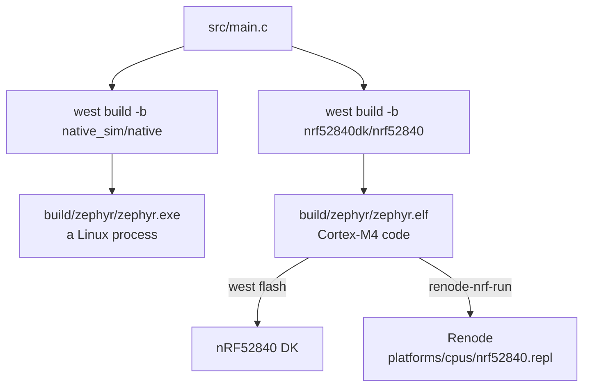

# 10-renode

This project is just to run real nRF52840 firmware without an nRF52840 board. You will
build it for `nrf52840dk/nrf52840` and run the resulting `zephyr.elf` in Renode, which
emulates the whole chip. It does not build for native_sim, and it has no test suite.

## What to learn here

- Where Renode sits next to native_sim and QEMU: it runs the same ELF you would flash,
  against a model of the SoC. See [Trivia](#trivia) below.
- The two kinds of Renode file. A `.repl` describes the hardware, and a `.resc` script
  creates a machine from it, loads the ELF and starts it. `run_nrf52.resc` is a `.resc`.
- Running the image two ways: `renode-nrf-run`, which puts UART0 on your terminal, and
  plain `renode` with `run_nrf52.resc`, which writes UART0 into Renode's log.
- Reading the emulated timer back through the Zephyr shell with `kernel uptime`.
- Finding what Renode does not model on this chip, from the warnings in
  `build/renode.log`.

## Layout

```
10-renode/
├── CMakeLists.txt
├── prj.conf            GPIO, plus the shell so there is something to type into
├── run_nrf52.resc      a Renode script: machine, ELF, UART analyzer, start
└── src/main.c          toggles led0 once a second and prints a tick
```

## Run it

```bash
cd apps/10-renode
```

```bash
west build -b nrf52840dk/nrf52840 -p
```

```bash
renode-nrf-run build
```

Leave it with `Ctrl-A` then `Ctrl-X`.

The same ELF with Renode itself, through `run_nrf52.resc`. Type `q` and Enter to
leave:

```bash
renode --console --disable-xwt -e "\$elf=@$PWD/build/zephyr/zephyr.elf; include @run_nrf52.resc"
```

For a board you own:

```bash
west flash
```

`renode` and `renode-nrf-run` come with the devcontainer image. If either gives
`command not found`, the container is running an older copy of the image, see
[`docs/troubleshooting.md`](../../docs/troubleshooting.md#renode-command-not-found-or-another-tool-a-readme-uses-is-missing).

## Expected outcome

From the `run_nrf52.resc` command, trimmed:

```
Starting emulation...
[INFO] nrf52840: Machine started.
[WARNING] sysbus: [cpu: 0x4E8E] (tag: 'FICR') ReadDoubleWord from non existing peripheral at 0x10000130, returning 0x00000000.
[WARNING] uart0: Unhandled write to offset 0x50C. Unhandled bits: [0, 3-31] when writing value 0x6. Tags: PIN (0x6), PORT (0x0), RESERVED (0x0), CONNECT (0x0).
[WARNING] rtc1: Unhandled write to offset 0x308. Unhandled bits: [1, 19] when writing value 0xF0003. Tags: OVRFLW (0x1).
[INFO] uart0: [host: 0.38s (+0.38s)|virt: 0.5ms (+0.5ms)] *** Booting Zephyr OS build v4.4.0 ***
[INFO] uart0: [host: 0.38s (+1.64ms)|virt:    0.5ms (+0s)] Hello from the Zephyr testing workshop!
[INFO] uart0: [host: 0.38s (+1.16ms)|virt:    0.5ms (+0s)] Board: nrf52840dk/nrf52840
[INFO] uart0: [host:   1.3s (+0.91s)|virt:       1s (+1s)] uart:~$ tick 1, led0 on
[INFO] uart0: [host:      2.3s (+1s)|virt:       2s (+1s)] tick 2, led0 off
[INFO] uart0: [host:      3.3s (+1s)|virt:       3s (+1s)] tick 3, led0 on
```

The `WARNING` lines come before the banner and are registers the model does not
implement. There are about twenty of them, and ★★ 3 in [`EXERCISE.md`](EXERCISE.md)
counts them. Each `uart0:` line carries two clocks: `host` is time on your machine and
`virt` is emulated time, and the ticks are one second apart in `virt`. The `uart:~$`
prompt is the shell, which takes no input in this mode because UART0 only goes to the
log. `q` at the `(nrf52840)` prompt quits.

## Trivia

### native_sim, QEMU and Renode

All three run Zephyr without the board you are targeting, and they do it in different
ways.

| | What runs | Board target | What is modelled |
|---|---|---|---|
| **native_sim** | your code compiled for the host, as a Linux process | `native_sim/native` | no CPU and no SoC. Peripherals come from emulated drivers such as `gpio_emul`. |
| **QEMU** | an ELF built for an emulated machine | `qemu_cortex_m3` and the other `qemu_*` boards | a CPU and a small set of devices. `qemu_cortex_m3` is a TI LM3S6965, a different chip from the one you ship. |
| **Renode** | the ELF you would flash to your real board | `nrf52840dk/nrf52840` | the SoC you ship: CPU, UART, timers, GPIO and more, each modelled to a different depth |



The `nrf52840dk/nrf52840` build is the same in both branches. Renode loads
`zephyr.elf`, and the drivers inside it are the real nRF52840 drivers from
`$ZEPHYR_BASE/drivers/`, talking to modelled registers.

### `.repl` and `.resc`

| | |
|---|---|
| **`.repl`** | a platform description. It lists the peripherals, their addresses and their interrupt lines. `platforms/cpus/nrf52840.repl` ships with Renode. |
| **`.resc`** | a script of Renode monitor commands. `run_nrf52.resc` creates a machine from the `.repl`, attaches an analyzer to UART0, loads `$elf` and starts. |

`renode-nrf-run` uses its own `.resc` for the nRF52840, which lives in the image at
`/opt/devcontainer/emu/nrf52840.resc`, and connects UART0 to a pseudo-terminal. That is
why the shell takes input under `renode-nrf-run`, and does not under
`run_nrf52.resc`, where UART0 only goes to the log. An app can put its own
`boards/nrf52840dk.resc` in place, and `renode-nrf-run` picks that one up instead.

### What you get and what you do not get

What you get:

- The ELF you would flash, unchanged. No overlay, no emulated driver, no board-specific
  `#ifdef`.
- The real SoC drivers running against register models.
- GDB on the firmware with no probe, through `renode-nrf-run build --gdb`.
- A run in CI with no board attached.

What you do not get:

- Every register. Anything the model does not handle is logged as a warning in
  `build/renode.log` and reads back as zero.
- Real timing. Renode keeps its own virtual time, so the ticks are a second apart in
  emulated time, which is not the same as a second of the real chip's cycles.
- Power consumption, analog behaviour, and anything outside the chip that is not
  described in the `.repl`.

## References

| | |
|---|---|
| [Renode documentation](https://renode.readthedocs.io/en/latest/) | the main manual, including the list of supported platforms |
| [Renode monitor syntax](https://renode.readthedocs.io/en/latest/basic/monitor-syntax.html) | variables such as `$elf`, `@` paths, and `include` |
| [Debugging with GDB](https://renode.readthedocs.io/en/latest/debugging/gdb.html) | what `machine StartGdbServer` does, which `--gdb` uses |
| [nRF52840 DK](https://docs.zephyrproject.org/latest/boards/nordic/nrf52840dk/doc/index.html) | the board this image is built for, including the LED and button pins |
| [`apps/00-hello`](../00-hello) | native_sim, for comparison with the table above |
