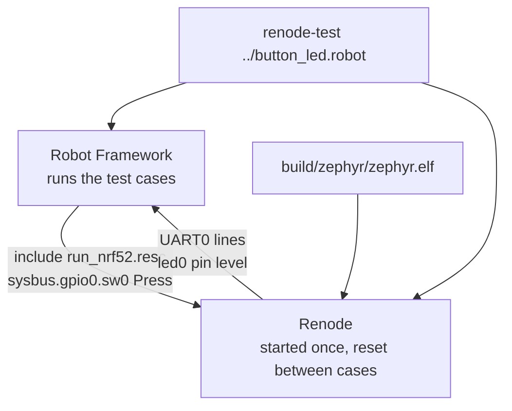

# 11-renode-test

This project is the button and LED from app 01, built for the nRF52840 DK and tested in
Renode by a Robot Framework file. You will build it and run `renode-test`, which presses
the button and checks the LED pin for you. It does not use native_sim, emulated drivers
or Twister, and nothing in the firmware exists only for the test.

**What changed since `10-renode`:** the app reacts to `sw0` now, `run_nrf52.resc` adds
the DK's button and LED to the machine and no longer starts it, and `button_led.robot`
is new.

## What to learn here

- What a Robot test for Renode looks like: a keyword that loads the machine, then test
  cases that act on it and check the result. See [Trivia](#trivia) below.
- Pressing the button from the test. `sysbus.gpio0.sw0 Press` changes pin 11, and the
  real nRF GPIO driver takes an interrupt from it. Compare it with app 04, where a
  test-only shell command drives `gpio_emul`.
- Checking two things after each press: the line the firmware prints, with
  `Wait For Line On Uart`, and the level on the LED pin, with `Assert LED State`.
- Why the `.resc` defines `sw0` and `led0` itself, with `invert: true`, and why it does
  not start the emulation.
- The press and release at the end of `Boot The DK`, which gets past a bug in Renode's
  model of the chip.

## Layout

```
11-renode-test/
├── CMakeLists.txt
├── prj.conf
├── run_nrf52.resc      the nRF52840 plus sw0 and led0, wired as on the DK
├── button_led.robot    two cases: first press turns led0 on, second turns it off
└── src/main.c          sw0 toggles led0, the same logic as app 01
```

## Run it

```bash
cd apps/11-renode-test
```

```bash
west build -b nrf52840dk/nrf52840 -p
```

```bash
cd build && renode-test ../button_led.robot
```

Running it from `build/` keeps the reports there. `renode-test` writes `log.html`,
`report.html`, `robot_output.xml` and `logs/` into the directory it is started from.

To press the button by hand, from `apps/11-renode-test`:

```bash
renode --console --disable-xwt -e "\$elf=@$PWD/build/zephyr/zephyr.elf; include @run_nrf52.resc; start"
```

Then, at the `(nrf52840)` prompt, `sysbus.gpio0.sw0 Press` and `sysbus.gpio0.sw0 Release`.
The first press after boot does nothing, see [Trivia](#the-first-press). `q` quits.

For a board you own:

```bash
west flash
```

`renode-test` stopping with `No module named 'robot'` means the container is running an
older copy of the image, see
[`docs/troubleshooting.md`](../../docs/troubleshooting.md#renode-command-not-found-or-another-tool-a-readme-uses-is-missing).

## Expected outcome

From `renode-test`, trimmed:

```
+++++ Starting test 'button_led.Should Turn The LED On When sw0 Is Pressed'
+++++ Finished test 'button_led.Should Turn The LED On When sw0 Is Pressed' in 1.49 seconds with status OK
+++++ Starting test 'button_led.Should Turn The LED Off At The Second Press'
+++++ Finished test 'button_led.Should Turn The LED Off At The Second Press' in 0.81 seconds with status OK
Suite ../button_led.robot finished successfully in 2.7 seconds.
...
Log:     /workspaces/zephyr-testing-workshop/apps/11-renode-test/build/log.html
Report:  /workspaces/zephyr-testing-workshop/apps/11-renode-test/build/report.html
Tests finished successfully :)
```

When a case fails, `renode-test` prints the terminal tester's report with every UART line
it saw, and saves Renode's log for that case as `build/logs/<case>.fail0.log`.

## Trivia

### What `renode-test` does



`renode-test` starts Renode, then runs Robot Framework with Renode's keywords loaded. Each
`Execute Command` line is a command typed into the Renode monitor. `Create Terminal Tester`
and `Create LED Tester` attach to UART0 and to `led0`, and the `Wait For` and `Assert`
keywords read from them. Renode is reset between test cases, so each case boots the DK
from the start.

### Why the `.resc` has its own button and LED

Renode ships `platforms/boards/nrf52840dk_nrf52840.repl` with the DK's buttons and LEDs,
but its buttons have no `invert: true`, so pin 11 reads low at rest. The DK's buttons
are active low, which makes the firmware see `sw0` as held from boot, and a `Press` in
Renode would release it. `run_nrf52.resc` defines `sw0` and `led0` itself, with
`invert: true` on both, the way the DK is wired.

The `.resc` does not run `start`. The test attaches its testers first and then starts
the emulation, so it cannot miss the first line the firmware prints.

### The first press

The nRF GPIO driver takes the button interrupt from a GPIOTE channel, the part of the
chip that turns a pin change into an event. When the driver sets the channel up,
Renode's model records the pin as low, although it rests high. The first press, high to
low, is then not a change to the model and is not reported. Once the button has been
released, the model has the right level and every later press works.

So `Boot The DK` ends with one `Press` and `Release` that the firmware does not see, and
the first `Assert LED State  false` confirms it. On the real chip this does not happen.
The model is `NRF52840_GPIOTasksEvents.cs` in the `renode-infrastructure` repository.

## References

| | |
|---|---|
| [Renode testing with Robot](https://renode.readthedocs.io/en/latest/introduction/testing.html) | `renode-test`, the terminal tester, the LED tester and the other keywords Renode adds |
| [Robot Framework User Guide](https://robotframework.org/robotframework/latest/RobotFrameworkUserGuide.html) | test case and keyword syntax, and variables such as `${CURDIR}` |
| [Renode platform description format](https://renode.readthedocs.io/en/latest/advanced/platform_description_format.html) | how the `.resc` connects `sw0` and `led0` to `gpio0`, and what `invert` does |
| [`apps/10-renode`](../10-renode) | the same board in Renode with no test |
| [`apps/12-renode-twister`](../12-renode-twister) | the same test, run by Twister |
