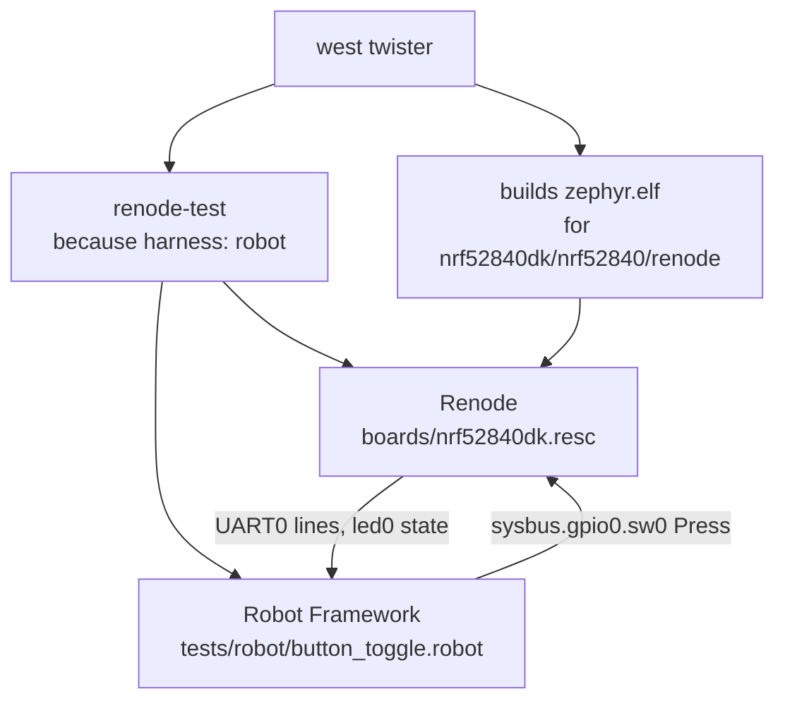

# 11-renode-twister

This project is the button and LED from app 01, built for the nRF52840 DK and tested in
Renode by a Robot Framework suite that Twister runs. You will run the suite with
`west twister`, and Renode presses the button and reads the LED pin for it. It does not
use native_sim or any emulated driver, and nothing in the firmware exists only for the
test.

**What changed since `10-renode`:** the app reacts to `sw0` now, and it has a test.
Renode still runs the nRF52840 DK image, and `boards/nrf52840dk.resc` adds the button
and the LED to the machine so the test can press one and read the other.

## What to learn here

- How Twister runs a Robot suite: `harness: robot` in `testcase.yaml`, with
  `renode-test` doing the run. See [Trivia](#trivia) below.
- Why the target is `nrf52840dk/nrf52840/renode` and not the stock board. Twister only
  runs Robot on a board that declares Renode in its yaml, so `boards/nordic/nrf52840dk/`
  extends the stock board with a variant that does. The firmware is the same.
- Pressing the button from the test. `sysbus.gpio0.sw0 Press` changes the pin that the
  real nRF GPIO driver reads, so the firmware takes a real GPIOTE interrupt. Compare it
  with app 04, where a test-only shell command drives `gpio_emul`.
- Asserting on the LED pin with `Assert LED State`, next to asserting on a UART line.
- The `Resample The Button Pin` keyword, which works around a bug in Renode's GPIOTE
  model that the second test case runs into.

## Layout

```
11-renode-twister/
├── CMakeLists.txt          adds this folder as a board root, before find_package(Zephyr)
├── prj.conf
├── src/main.c              sw0 toggles led0, the same logic as app 01
├── testcase.yaml           harness: robot, selects the board with depends_on: renode
├── tests/robot/
│   └── button_toggle.robot three cases: boot, first press, press and release
└── boards/
    ├── nrf52840dk.resc     Renode machine: the nRF52840 plus sw0 and led0, wired as on the DK
    └── nordic/nrf52840dk/  board extension, the nrf52840dk/nrf52840/renode variant
        ├── board.yml
        ├── nrf52840dk_nrf52840_renode.dts        includes the stock board's .dts
        ├── nrf52840dk_nrf52840_renode_defconfig  a copy of the stock defconfig
        ├── nrf52840dk_nrf52840_renode.yaml       simulation: renode, testing.renode
        └── Kconfig.nrf52840dk                    selects the SoC for the variant
```

`testcase.yaml` sits at the top of the app, not under `tests/`, because the image under
test is the app itself. There is no separate test build.

## Run it

From the repository root:

```bash
west twister -T apps/11-renode-twister -p nrf52840dk/nrf52840/renode --board-root $PWD/apps/11-renode-twister/boards -O /tmp/tw11 --clobber-output
```

`--board-root` has to be an absolute path. With a relative one Twister finds the board,
but `renode-test` runs from the build directory and fails with
`File does not exist: apps/11-renode-twister/boards/nrf52840dk.resc`.

To watch the image boot without the test:

```bash
cd apps/11-renode-twister
```

```bash
west build -b nrf52840dk/nrf52840/renode -p
```

```bash
renode-nrf-run build
```

For the board itself, build the stock target and flash it:

```bash
west build -b nrf52840dk/nrf52840 -p && west flash
```

`renode-test` stopping with `No module named 'robot'` means the container is running an
older copy of the image, see
[`docs/troubleshooting.md`](../../docs/troubleshooting.md#renode-command-not-found-or-another-tool-a-readme-uses-is-missing).

## Expected outcome

```
INFO    - 1 test scenarios (1 configurations) selected, 0 configurations filtered (0 by static filter, 0 at runtime).
INFO    - 1 of 1 executed test configurations passed (100.00%), 0 built (not run), 0 failed, 0 errored, with no warnings in 27.58 seconds.
INFO    - 1 of 1 executed test cases passed (100.00%) on 1 out of total 1474 platforms (0.07%).
```

Twister counts the whole Robot file as one test case. The result of each Robot case is
in `handler.log`, under
`/tmp/tw11/nrf52840dk_nrf52840_renode/zephyr_gnu/.../app11.button.robot/`, trimmed:

```
+++++ Finished test 'button_toggle.Should Boot With The LED Off' in 1.08 seconds with status OK
+++++ Finished test 'button_toggle.Should Turn The LED On When sw0 Is Pressed' in 0.41 seconds with status OK
+++++ Finished test 'button_toggle.Should Toggle On The Press And Not On The Release' in 1.42 seconds with status OK
```

The same folder has Robot's `log.html` and `report.html`. When a case fails, it also
gets `logs/<case>.fail0.log` with Renode's own log, and `snapshots/<case>.fail0.save`
with the emulation state at the moment it failed.

## Trivia

### Who runs what



Twister hands `renode-test` four values: `ELF` (the build), `RESC` and `UART` (from the
variant's yaml), and `KEYWORDS`, which is `$ZEPHYR_BASE/tests/robot/common.robot`. That
file defines `Prepare Machine`, which sets `$elf`, includes the `.resc` and attaches a
terminal tester to UART0. Every case in `button_toggle.robot` starts with it, and
Renode resets the machine between cases.

### Why a board variant

Twister picks the Renode handler only for a platform whose yaml has these fields.
Zephyr's own `nrf52840dk_nrf52840.yaml` has none of them.

| Field | What Twister does with it |
|---|---|
| `simulation: - name: renode` | marks the platform as one that runs in Renode, so `harness: robot` suites on it are run and not only built |
| `testing.renode.uart` | the UART the terminal tester attaches to, `sysbus.uart0` |
| `testing.renode.resc` | the machine description, relative to the folder above `--board-root` |

The variant comes from a board extension: `board.yml` says `extend: nrf52840dk` and
adds a variant named `renode`. Its `.dts` includes the stock one, so the generated
`build/zephyr/zephyr.dts` is the stock board's, and `build/zephyr/.config` differs only
in the board name symbols.

`testcase.yaml` selects the variant with `depends_on: renode`, a feature only the
variant's yaml lists. Naming the variant in `platform_allow` works for this app, but
Twister checks every name there against the platforms it knows, and a repo-wide
`west twister -T apps/ -p native_sim` does not load this board root. That run would
stop at the check before building anything.

### The first press and Renode's GPIOTE model

Renode ships `platforms/boards/nrf52840dk_nrf52840.repl` with the DK's buttons, but
without `invert: true` on them, so pin 11 reads low at rest. The DK's buttons are active
low, which makes the firmware see `sw0` as held from boot. `boards/nrf52840dk.resc`
defines `sw0` and `led0` itself, with `invert: true`, the way the DK is wired.

With that fixed, the first press still went unseen. The nRF GPIO driver takes an edge
interrupt from a GPIOTE channel. When it writes the channel's `CONFIG` register, Renode's
model samples the pin, and then the `OUTINIT` field of the same write sets the sampled
level to 0. `sw0` rests high, so the model believes it is low, and the first high to low
change is not an edge to it. On the chip, `OUTINIT` has no effect in event mode.
`Resample The Button Pin` in `button_toggle.robot` rewrites each event channel's
`CONFIG` with `OUTINIT` set, which puts the stored level back to high.

The case that shows it is `Should Turn The LED On When sw0 Is Pressed`. It fails without
the keyword and passes with it. The model's source is `NRF52840_GPIOTasksEvents.cs` in
the `renode-infrastructure` repository.

## References

| | |
|---|---|
| [Twister](https://docs.zephyrproject.org/latest/develop/test/twister.html) | `harness`, `harness_config`, `depends_on` and the other `testcase.yaml` keys |
| [Board extensions](https://docs.zephyrproject.org/latest/hardware/porting/board_porting.html) | the `extend:` form of `board.yml`, in the section of the same name |
| [Renode testing with Robot](https://renode.readthedocs.io/en/latest/introduction/testing.html) | `renode-test`, the terminal tester and the other keywords Renode adds to Robot |
| [Robot Framework User Guide](https://robotframework.org/robotframework/latest/RobotFrameworkUserGuide.html) | test case and keyword syntax, `FOR` and `IF` |
| [`apps/10-renode`](../10-renode) | the same board in Renode with no test, and `renode-nrf-run` |
| [`apps/04-shell-pytest`](../04-shell-pytest) | the same button and LED on native_sim, driven through a test-only shell command |
