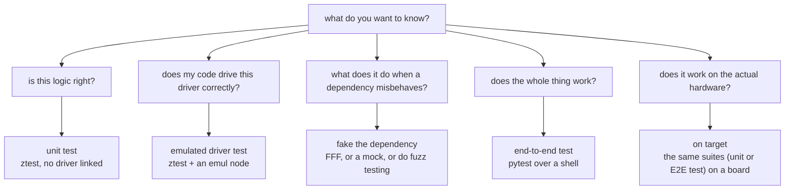

# Testing levels

Testing have different levels to it. Which level you will commit to depends on your
current needs.

## Unit

Unit testing is a form of testing in which it focuses on a single unit of work. What
defines a unit of work isn't exactly bound to file, class, etc. It may vary based on
user preferences. A unit test tries to create the smallest level of self sufficient
work unit, in which it can be tested decoupled from any external input or outputs.
This way, if one day after a development the compile seems to break, one can easily
narrow down and pinpoint which exact work unit has failed.

Creating unit tests is good for arithmetic, state machines, and parsing, where you can
name the input and the expected output. They run fast enough to run on every save.

A unit suite is blind to integration. It can pass while two modules disagree about who
calls whom.

Creating a good unit test requires a seam, in which a logical boundary can be drawn
between different work units. This seam should then be further emphasized by
decoupling between these work units with say an API call or a dependency injection
pattern. This way we can create better separation of concerns within our software. If a
module reaches for a driver in the middle of its logic, extract the decision to make it
testable.

## Emulated driver

Emulated driver testing runs your code against the real driver, with a fake peripheral
underneath it. The devicetree decides that last part, so the driver itself stays
unmodified.

This is what you reach for when the question is whether you drive a chip correctly:
the register sequence, the calibration handling, the bus transactions. In
`apps/06-sensor` the real Bosch BME280 driver runs against an emulated chip and
produces the datasheet's own numbers.

An emulated test is blind to anything electrical, and to anything the emulator does not
model. See [`what-you-cannot-test.md`](what-you-cannot-test.md).

It is also awkward for error paths. Making a plausible chip misbehave in a specific way
is fiddly, which is what the next level is for.

## Faked dependency

Faked dependency testing takes the module under test and replaces the functions it
calls. FFF does this in C, gmock does this in C++.

This level is good for the questions an emulator is bad at. Three `-EIO` in a row then
a recovery is one line. So is "was this called at all", which no amount of looking at
an LED will tell you.

It is blind to whether the real implementation behind the fake works. Every test at
this level still passes if you delete the driver.

## End to end

End to end testing runs the whole application, driven from outside over a shell or a
protocol, and asserted from a process that has a network, a filesystem and a language
with libraries.

It is good for whether the product works, and for anything needing computation or state
across steps.

End to end tests are slow, and a failure tells you something is wrong without telling
you where. A suite made only of these is expensive to own.

## On target

On target testing runs any of the above on a real board.

It is the only level that sees real timing, real peripherals, real power behaviour, and
the board actually being wired the way you think.

The cost is a flash cycle per run, a board on somebody's desk, and a self-hosted runner
to put in CI.

Note that emulated tests run here too. Emulation is a devicetree choice, not an
off-target one, and
`.github/workflows/test-hardware.yml` runs the emul suite on
an nRF5340DK.

## Picking

| You want to know | Level |
|---|---|
| is this calculation right | unit |
| does the state machine handle this sequence | unit |
| do I drive this chip correctly | emulated driver |
| what happens when the read fails | faked dependency |
| is this function called once or on every tick | faked dependency |
| does the feature work from the user's side | end to end |
| does it meet a deadline, draw the right current, survive the real bus | on target, nothing else |

Most of the cost of a test suite is owning it, so the useful question when adding one
is what would have to break for this test to fail, and whether that is something that
could plausibly break.

## In this repo

| Level | Apps |
|---|---|
| unit | `02-ztest`, `07-unit-conventions` |
| emulated driver | `03-emul-gpio`, `06-sensor` |
| faked dependency | `08-fff-mocks`, `09-gtest-gmock` |
| end to end | `04-shell-pytest`, `05-pytest-advanced` |
| on target | the same suites, plus the self-hosted workflows |

When an app changes, this table is what to check.
