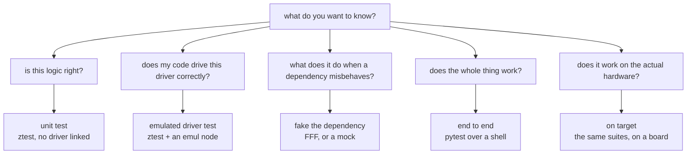

# Testing levels

For someone deciding where a particular test belongs. The repo has a worked example of
each level, listed at the end.

The question is not which level is best. It is which one answers the question you
actually have, because each level is blind to different things.

## Unit

One module, nothing else linked. No driver, no devicetree, no bus.

Good for arithmetic, state machines, parsing, anything where you can name the input
and the expected output. Fast enough to run on every save.

Blind to everything about integration. A unit test suite can be entirely green while
the two modules it covers disagree about who calls whom.

The prerequisite is a seam. If a module reaches for a driver in the middle of its
logic, there is nothing to link on its own, and the answer is usually to extract the
decision rather than to write a harder test.

## Emulated driver

Your code, the real driver, and a fake peripheral underneath it. The devicetree
decides that last part.

Good for whether you drive a chip correctly: the register sequence, the calibration
handling, the bus transactions. In `apps/06-sensor` the real Bosch BME280 driver runs
unmodified against an emulated chip and produces the datasheet's own numbers.

Blind to anything electrical, and to anything the emulator does not model. See
[`what-you-cannot-test.md`](what-you-cannot-test.md).

Awkward for error paths. Making a plausible chip misbehave in a specific way is
fiddly, which is what the next level is for.

## Faked dependency

The module under test, with the functions it calls replaced. FFF in C, gmock in C++.

Good for the questions an emulator is bad at. Three `-EIO` in a row then a recovery is
one line. So is "was this called at all", which no amount of looking at an LED will
tell you.

Blind to whether the real implementation behind the fake works. Every test at this
level still passes if you delete the driver.

## End to end

The whole application, driven from outside over a shell or a protocol, asserted from a
process that has a network, a filesystem and a language with libraries.

Good for whether the product works, and for anything needing computation or state
across steps.

Slow, and a failure tells you something is wrong without telling you where. A suite
made only of these is expensive to own.

## On target

Any of the above, running on a real board.

The only level that sees real timing, real peripherals, real power behaviour, and the
board actually being wired the way you think.

Costs a flash cycle per run, a board on somebody's desk, and a self-hosted runner to
put in CI.

Note that emulated tests run here too. Emulation is a devicetree choice, not an
off-target one, and
`.github/workflows/test-hardware.yml` runs the emul suite on
an nRF5340DK.

## Picking

| You want to know | Level |
|---|---|
| is this calculation right | unit |
| does the state machine handle this sequence | unit |
| do I drive this chip correctly | emulated driver |
| what happens when the read fails | faked dependency |
| is this function called once or on every tick | faked dependency |
| does the feature work from the user's side | end to end |
| does it meet a deadline, draw the right current, survive the real bus | on target, nothing else |

Most of the cost of a test suite is owning it, so the useful question when adding one
is what would have to break for this test to fail, and whether that is something that
could plausibly break.

## In this repo

| Level | Apps |
|---|---|
| unit | `02-ztest`, `07-unit-conventions` |
| emulated driver | `03-emul-gpio`, `06-sensor` |
| faked dependency | `08-fff-mocks`, `09-gtest-gmock` |
| end to end | `04-shell-pytest`, `05-pytest-advanced` |
| on target | the same suites, plus the self-hosted workflows |

When an app changes, this table is what to check.
