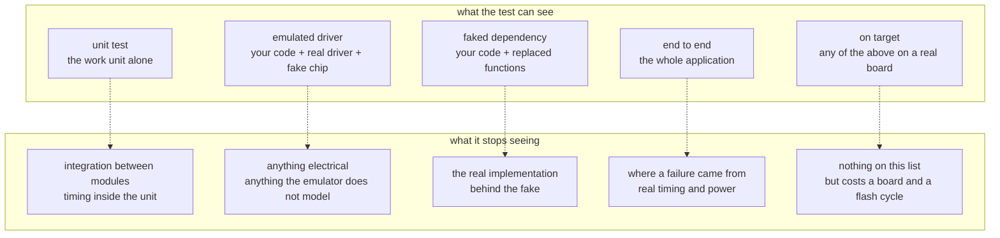

# Test coverage gaps

This page lists what the test suites in this repo do not cover, so a green run is
read for what it is worth. It is the companion to
[`testing-levels.md`](testing-levels.md), which covers what each level is for.

Each section names a tool, what it does model, and what it does not. The gaps are
grouped by tool because that is where a reader will hit them: knowing that `gpio_emul`
does not model drive strength is useful when you are reading an emulated GPIO test, and
not before.

The sections below are ordered from the narrowest tool to the widest: `gpio_emul`,
then bus emulators, then `native_sim`, then fakes and mocks, then the things no test
here covers at all.

## Gaps by level

## What `gpio_emul` does not model

`gpio_emul` is a variable with callbacks attached. It keeps track of pin levels,
interrupt edges and pull-ups, and it can answer questions about them. It knows nothing
about the electrical side of a pin:

- drive strength and slew rate
- contact bounce
- current limits, and what happens past them
- two things driving the same net
- capacitance, rise time, anything analog
- what a pin does during reset, or before `main()`

The source is short and you can read it to see the whole model:
`$ZEPHYR_BASE/drivers/gpio/gpio_emul.c`.

## What a bus emulator does not model

`i2c_emul` and its siblings deliver bytes to a function you wrote. What they deliver is
whatever you told them to, so what they do not model is the bus itself:

- clock stretching, arbitration, or a second master
- a device that NAKs intermittently, unless you write that in
- bus capacitance, pull-up sizing, rise time
- a device that is simply not soldered on
- the wrong address, because the fake answers at whatever address you gave it

`apps/06-sensor` proves the app talks to a BME280 correctly. It cannot tell you there
is a BME280 on the board.

## What `native_sim` does not model

`native_sim` is native code in a normal process, not a simulated CPU. That difference
decides what it can answer.

- **Timing.** `k_sleep()` is honoured against the host clock. Nothing tells you whether
  an ISR meets a deadline on a Cortex-M.
- **Concurrency as it will really interleave.** The scheduler runs, but on different
  hardware with a different memory model.
- **The instruction set.** Compiled for x86 with different integer promotion,
  alignment and word size. `native_sim/native` is 32-bit, which catches some of this;
  a 64-bit build catches less.
- **Memory limits.** No flash or RAM ceiling, so nothing here tells you it fits.
- **Faults.** No MPU, no bus fault, no hard fault handler doing what it would.

## What a fake does not tell you

Faking and mocking is a concept in which someone wants to test a work unit in
isolation, without pulling in the real dependency it talks to. An example is faking a
sensor read so it returns a fixed value, or mocking a bus call so you can assert it was
called with the right arguments. Once the dependency is replaced, the user can focus on
the logic of the work unit in hand and detach from the external linkages.

Knowing that fakes and mocks replace real dependencies, if we actually delete or alter
those dependencies, or make them work entirely differently, these fakes and mocks could
potentially be misleading.

Every test in `apps/08-fff-mocks` still passes with the real implementation deleted.
That is the trade: you pinned the module and pinned nothing about the thing behind it.

The same applies to gmock in `apps/09-gtest-gmock`.

## What no test in this repo covers

- power draw, sleep current, wake latency
- EMC, ESD, anything about the physical product
- analog accuracy, ADC noise, reference drift
- flash wear, brownout, unexpected power loss mid-write
- anything about the radio: range, interference, coexistence
- the bootloader, secure boot, and what happens to a half-written update
- a chip that is out of spec, counterfeit, or damaged

## Conclusion

Having a green (successful) test suite run acts as a clamp. It helps assure you that
what have been written and was running will still be running. Its shortcomings is when
one tries to understand hardware issues, or whether the business logic has been written
correctly.

## In this repo

| Concept | What it provides | App | What it does not cover |
|---|---|---|---|
| `gpio_emul` | pin levels, interrupt edges, pull-ups | `03-emul-gpio`, `04-shell-pytest` | drive strength, bounce, current limits, anything analog |
| `i2c_emul` and siblings | bytes delivered to your function | `06-sensor` | clock stretching, NAKs, bus capacitance, whether the part is on the board |
| FFF and gmock | the module under test, with its dependencies replaced | `08-fff-mocks`, `09-gtest-gmock` | whether the real implementation behind the fake works |
| `native_sim` | the application logic, on the host | every `native_sim` run | real timing, real memory limits, real faults |
