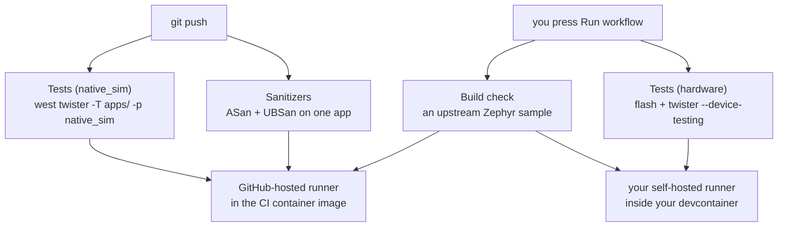

# CI

For someone looking at the GitHub Actions tab and working out what runs when, or
adapting the workflows to their own board. The files are in
[`../../.github/workflows/`](../../.github/workflows/).

There are four, and each one answers a different question.

| Workflow | Answers | Runs on | When |
|---|---|---|---|
| `test-native-sim.yml` | do all the test suites still pass | GitHub's runner | every push and pull request |
| `sanitizers.yml` | does one app run clean under ASan and UBSan | GitHub's runner | every push and pull request |
| `build-check.yml` | does the toolchain work at all | both | manual |
| `test-hardware.yml` | does it build, flash and pass on a real board | your runner | manual |

The two that run automatically need no hardware and no setup. The two manual ones do.



## Why build-check builds someone else's code

`build-check.yml` is the only one that does not touch `apps/`. It builds
`samples/hello_world` from upstream Zephyr and greps the output for `Hello World`.

That is deliberate. When something fails and you cannot tell whether the problem is
your environment or the code in this repo, this separates the two. If it passes, the
container and the SDK are fine and the problem is in `apps/`. If it fails, nothing in
this repo is the cause.

It also has a self-hosted job that checks `ZEPHYR_BASE`, `ZEPHYR_SDK_INSTALL_DIR` and
`ZEPHYR_TOOLCHAIN_VARIANT` are set before it builds anything. A runner registered
outside the devcontainer will have none of them, and without that check the failure
arrives much later and says much less. See
[`self-hosted-runner.md`](self-hosted-runner.md) for registering one.

## Running on your own board

Two things to change, and no probe serial in either.

**The board**, in `test-hardware.yml`:

```yaml
env:
  BOARD: nrf5340dk/nrf5340/cpuapp
```

**The probe and the serial port**, in
[`../../apps/04-shell-pytest/hardware-map.yaml`](../../apps/04-shell-pytest/hardware-map.yaml).
That file has commented-out blocks for ESP32-S3 and Nucleo G474RE already. To find
your own values:

```bash
west twister --generate-hardware-map map.yaml
```

Twister reads the `id` field and turns it into whatever the runner wants: `--dev-id`
for nrfutil, `--board-id` for pyocd, `--esp-device` for esp32. So the map is the only
place your hardware is described.

The flash step needs neither:

```bash
west build -b "$BOARD" apps/01-blinky -d build -p
west flash -d build
```

`west flash` reads the board out of the build directory and picks the runner from it,
so the same two lines work for nRF, ESP32 and Nucleo. With one probe attached it finds
it without being told which.

## When a run fails

Open the failing job in the Actions tab and read from the top of the log, not the
bottom. The first line that reports an error tells you which tool produced it: `cmake`,
`gcc`, `ld`, the flash runner, or the test harness. That is usually enough to know
where to look.

For the two native_sim workflows, the faster move is to reproduce it locally, because
the command is the same one you run by hand:

```bash
west twister -T apps/ -p native_sim
```

`test-hardware.yml` cannot be reproduced without the board, so it uploads
`twister-out/` as an artifact when it fails. Download it from the run summary page.
`handler.log` inside it holds everything the device printed.
[`../troubleshooting.md`](../troubleshooting.md) keys the common failures by what you
are looking at.

## Notes on the sanitizers job

`native_sim/native` is a 32-bit build, so it needs the 32-bit sanitizer runtimes,
`lib32asan` and `lib32ubsan`, not the x86-64 pair. The CI container image ships them.
Building `native_sim/native/64` instead would need the amd64 variants.

The job asserts `CONFIG_ASAN=y` and `CONFIG_UBSAN=y` in `build/zephyr/.config` before
running anything. A wrong `EXTRA_CONF_FILE` path is silently ignored by CMake, and
without that check the job would pass while sanitizing nothing.

It then greps the run log for findings rather than trusting the exit code, because ASan
can be built to report and keep going.

## Adding a workflow

The container image tag is pinned in each file:

```yaml
container:
  image: ghcr.io/royyandzakiy/zephyr-devcontainer-ci:z4.4.2-sdk1.0.1
```

It sets `ZEPHYR_BASE`, which is how `west` finds its workspace from a plain
`actions/checkout` with no `west init`. That is why `west twister -T apps/` works
directly in `test-native-sim.yml`.

Two of these workflows have a status badge at the top of the root
[`README.md`](../../README.md), and the badge URL contains the workflow's **file name**:

```
.../actions/workflows/test-native-sim.yml/badge.svg?branch=main
```

So renaming a workflow file breaks its badge, silently, into a broken image. Rename the
badge URL at the same time. `build-check.yml` and `test-hardware.yml` have no badge on
purpose: they only run manually, so a badge for either would report nothing.
