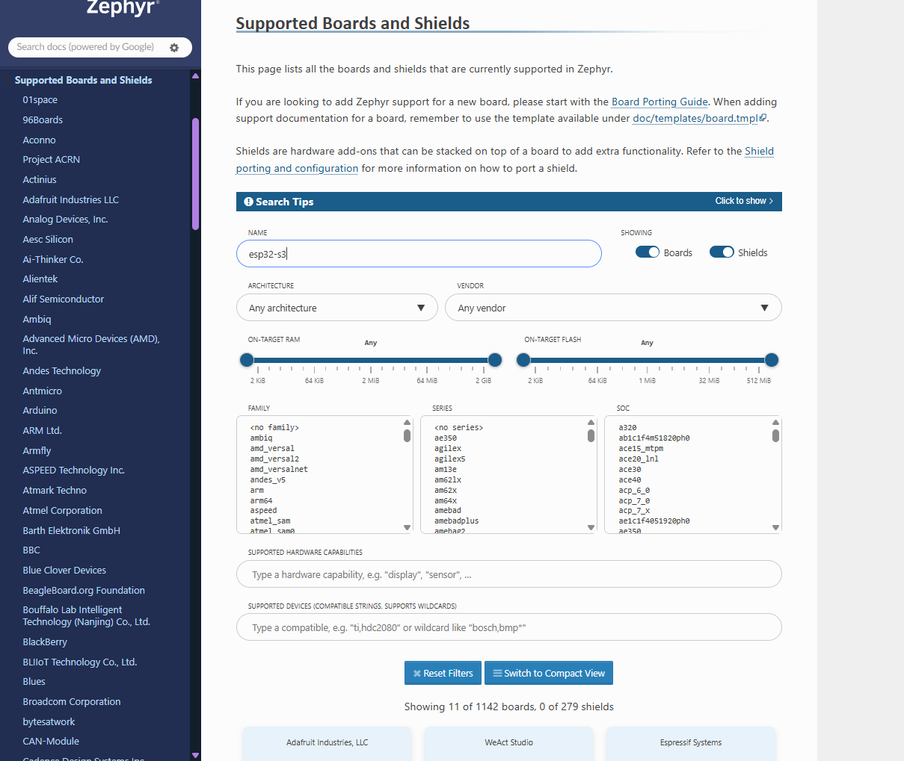
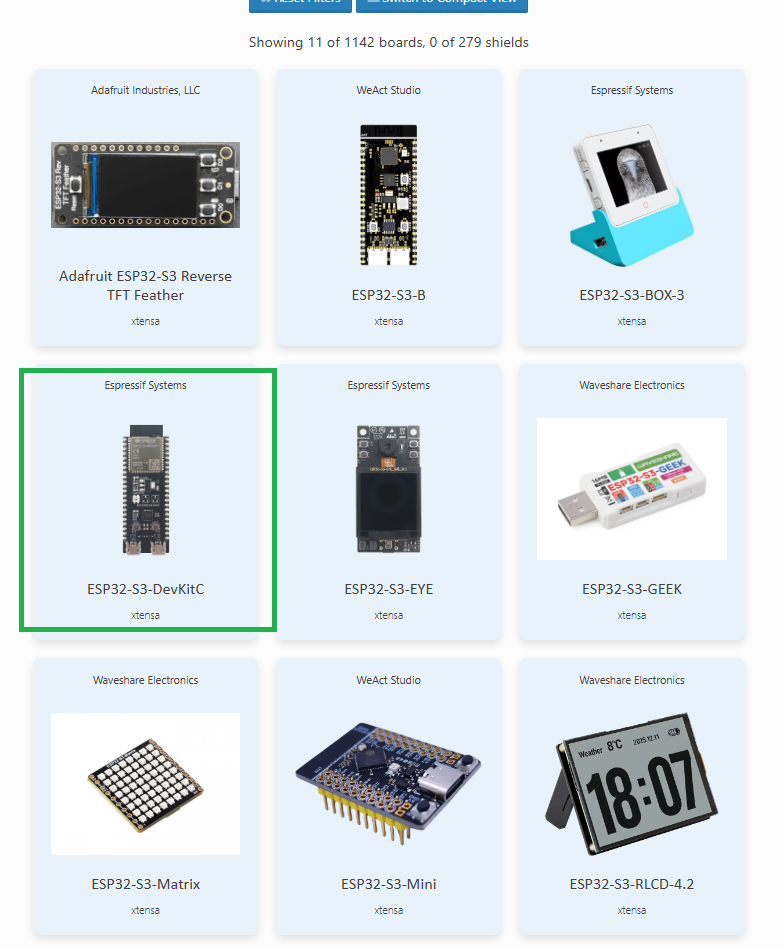

# Build, flash and monitor a board

For someone checking their environment works. Build and run a native_sim binary, then
build and flash a real board if you have one. Each vendor needs slightly different
setup, and those are below.

Once this works, [`../reference/boards.md`](../reference/boards.md) is the full command
reference.

## Off-Target: Native Sim

Here you can try to compile the sample hello world from zephyr, then run the binary

```bash
export BOARD="native_sim/native"

west build -b $BOARD -s $ZEPHYR_BASE/samples/hello_world -p always -d build_hello_world

# Monitor, just run like a normal executable
./build_hello_world/zephyr/zephyr.exe
```

## On-Target

### Searching for boards

- You can search for your specific board or development kit by accessing this page

[Zephyr - Supported Boards & Shields](https://docs.zephyrproject.org/latest/boards/index.html#supported-boards-and-shields)




Below are the steps for Nordic, Espressif and ST Microelectronics boards.

Port numbers depend on enumeration order and on what else is plugged in. Check yours
with `ls /dev/ttyACM* /dev/ttyUSB*` rather than copying the ones here.

### Nordic

No setup, all nrf boards ready to use

```bash
export BOARD="nrf5340dk/nrf5340/cpuapp"

# Build
west build -b $BOARD -s $ZEPHYR_BASE/samples/hello_world -d build_hello_world -p always

# Flash & Reset
west flash -d build_hello_world
# Or use nrfutil directly
nrfutil device erase
nrfutil device program --firmware build_hello_world/zephyr/zephyr.hex
nrfutil device reset

# Monitor (press Ctrl+] to exit)
python3 -m serial.tools.miniterm /dev/ttyACM1 115200 --raw
```

### Additional Resources
- https://docs.zephyrproject.org/latest/boards/nordic/nrf5340dk/doc/index.html

### Espressif

The Xtensa toolchains are **already installed** - `ZSDK_TOOLCHAINS` in
[`.devcontainer/devcontainer.json`](../../.devcontainer/devcontainer.json) lists both
`xtensa-espressif_esp32_zephyr-elf` and `xtensa-espressif_esp32s3_zephyr-elf`, and
`setup-sdks.sh` installs them on first container start. `zephyr-stores` shows what you have.

One thing still needed per workspace - the Espressif binary blobs are not in the git tree:

```bash
west blobs fetch hal_espressif
```

To add a toolchain for a different chip (ESP32-S2, a RISC-V ESP32-C3, …), append the triple
to `ZSDK_TOOLCHAINS` in `containerEnv` and restart the container. `setup-sdks.sh` tops up the
shared SDK incrementally, so nothing is re-downloaded. `west sdk list` shows the available
triples. To install one immediately without restarting:

```bash
/opt/devcontainer/fetch-zephyr.sh    # re-runs setup.sh -t for the configured toolchains
```

```bash
export BOARD="esp32s3_devkitc/esp32s3/procpu"

# Build
west build -b $BOARD -s $ZEPHYR_BASE/samples/hello_world -d build_hello_world -p always

# Flash (west handles esptool underneath)
west flash --runner esp32 --esp-device /dev/ttyACM0 -d build_hello_world

# Monitor (press Ctrl+] to exit)
python3 -m serial.tools.miniterm /dev/ttyACM0 115200 --raw
```

Error: Espressif toolchain not yet installed

```bash
Make Error at /workdir/zephyr-sdks/v4.2.2/zephyr/cmake/compiler/gcc/target.cmake:11 (message):
  C compiler
  /workdir/zephyr-sdks/toolchains/zephyr-sdk-0.17.0/xtensa-espressif_esp32s3_zephyr-elf/bin/xtensa-espressif_esp32s3_zephyr-elf-gcc
  not found - Please check your toolchain installation
```

Solution: you must install the correct sdk for your board using the `west sdk install` command

### Additional Resources:
- https://docs.zephyrproject.org/latest/boards/espressif/esp32s3_devkitc/doc/index.html

### ST Microelectronics

Additional setup to be able to compile to board

```bash
pyocd list # find the target for your board
pyocd list --targets # or, list all available targets to install

pyocd pack install stm32g474retx # change based on your board
```

```bash
export BOARD="nucleo_g474re"

west build -b $BOARD -s $ZEPHYR_BASE/samples/hello_world -d build_hello_world -p always

west flash --runner pyocd -d build_hello_world/
# or, to be specific
west flash --runner pyocd -d build_hello_world/ -- --dev-id 0046002E3234510A37333934

# Monitor (press Ctrl+] to exit)
python3 -m serial.tools.miniterm /dev/ttyACM0 115200 --raw
```

Error: STM32 G4 not yet installed

```bash
-- west flash: rebuilding
ninja: no work to do.
-- west flash: using runner pyocd
-- runners.pyocd: Flashing file: build_nucleog4_test_gpio_toggle/zephyr/zephyr.hex
Waiting for a debug probe to be connected...
0026001 C Target type stm32g474retx not recognized. Use 'pyocd list --targets' to see currently available target types. See <https://pyocd.io/docs/target_support.html> for how to install additional target support. [__main__]
FATAL ERROR: command exited with status 1: pyocd flash -e sector -a 0x8000000 -t stm32g474retx build_nucleog4_test_gpio_toggle/zephyr/zephyr.hex
```

```bash
root@d9bcb3911f2d:/workspaces/zephyr-testing-workshop# pyocd list
  #   Probe/Board     Unique ID                  Target           
------------------------------------------------------------------
  0   STLINK-V3       0046002E3234510A37333934   ✖︎ stm32g474retx  
      NUCLEO-G474RE                                              
```

Solution: you do not have the correct board sdk installed, use `pyocd pack install [target]` command with the appropriate board

### Additional Resources:
- https://docs.zephyrproject.org/latest/boards/st/nucleo_g474re/doc/index.html